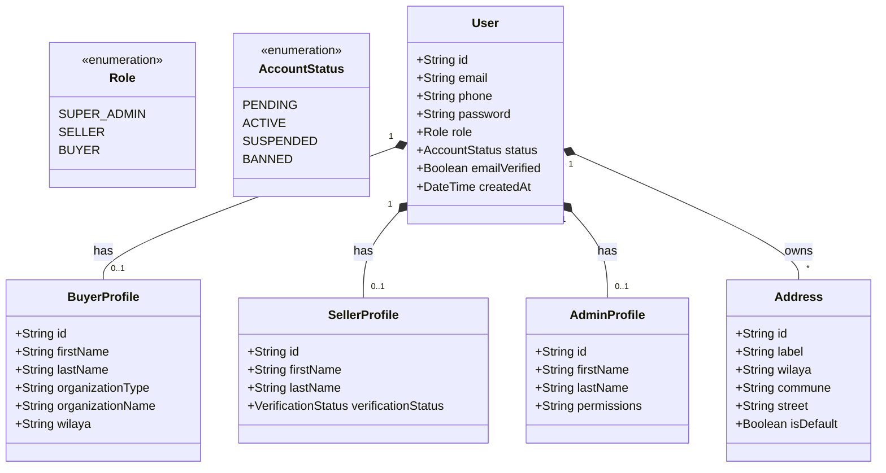
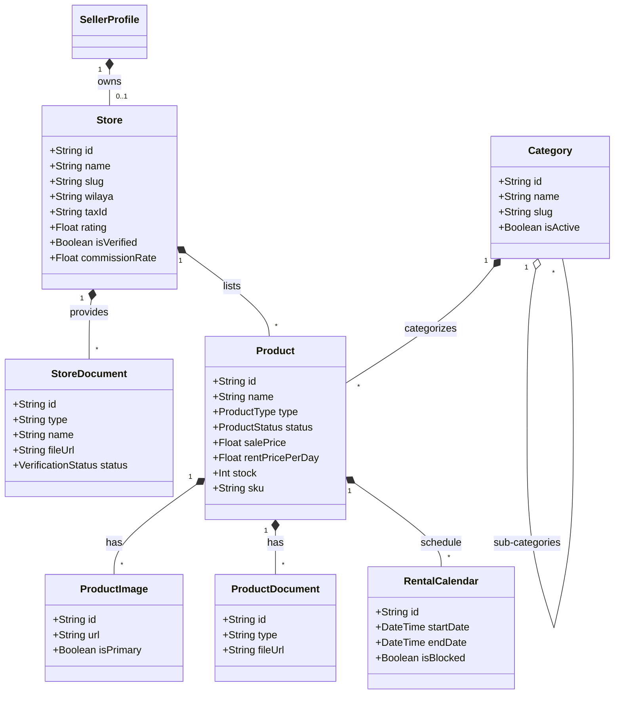
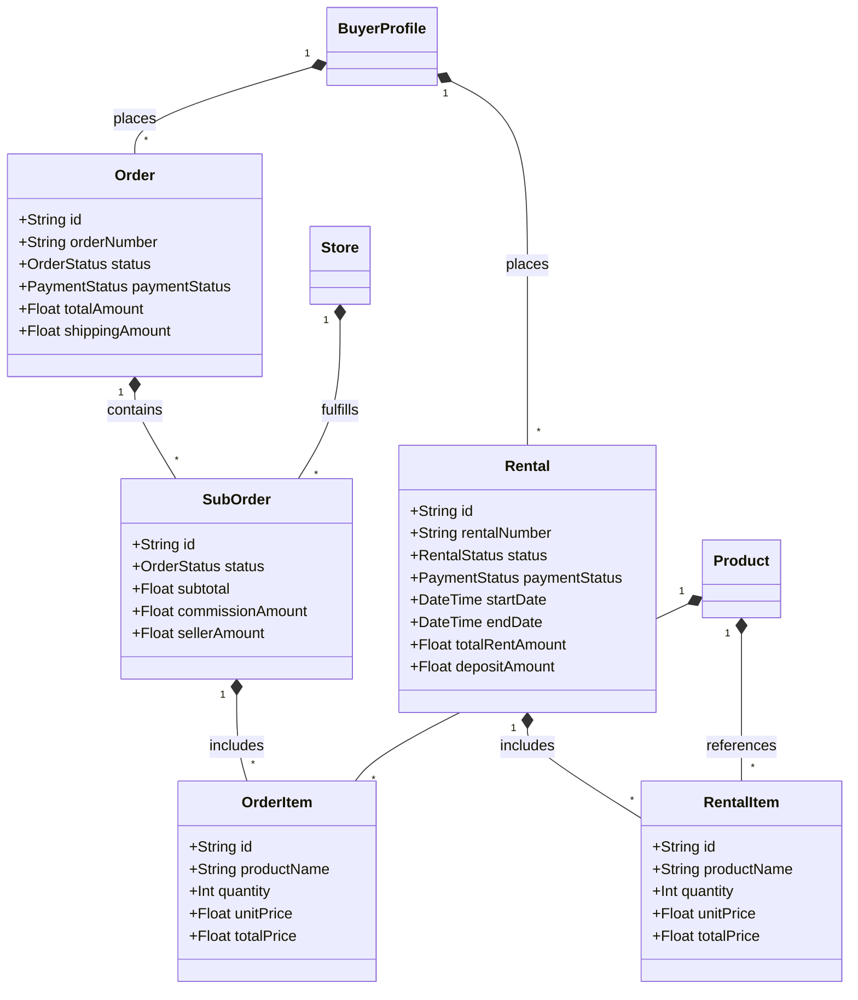
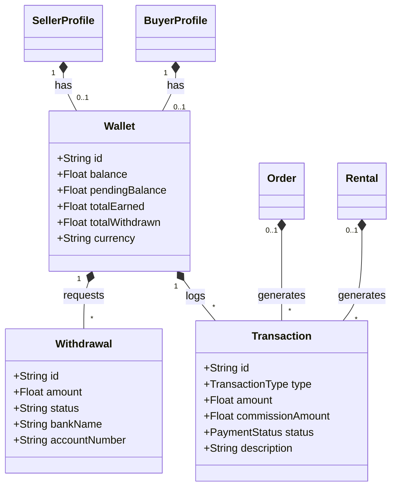
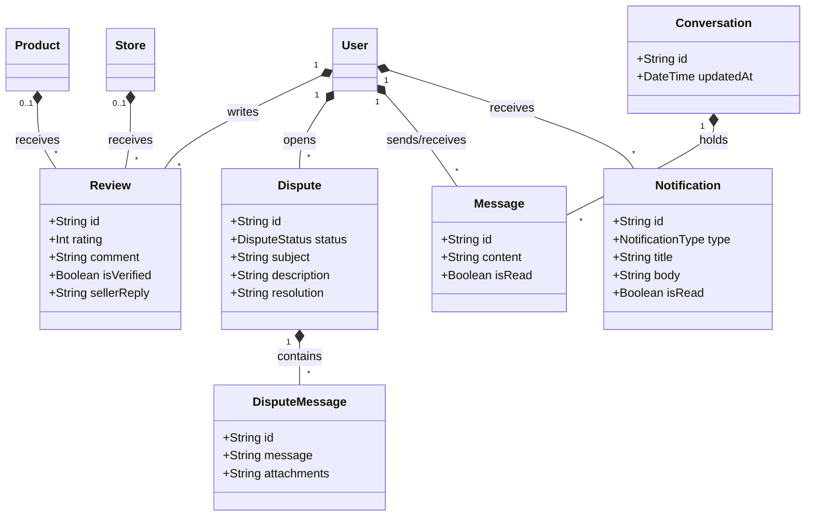

# المخطط الشامل لقاعدة البيانات (Class Diagram) - MediShop Pro

نظراً لحجم النظام وتعدد العلاقات، تم تقسيم المخطط الشامل إلى **5 أجزاء رئيسية** ليكون أكثر وضوحاً وقابلية للقراءة. يعتمد هذا المخطط على بنية قاعدة البيانات (Prisma Schema) الخاصة بالخادم (Backend).

## 1. إدارة المستخدمين والملفات الشخصية (Users & Profiles)
يوضح هذا المخطط الكيانات الأساسية للمستخدمين، ملفاتهم الشخصية حسب الصلاحيات (مشتري، بائع، مسؤول)، وعناوينهم.

---

## 2. المتاجر وإدارة الكتالوج (Store & Catalog)
يوضح هذا المخطط بنية المتاجر، الوثائق، الفئات (التصنيفات)، والمنتجات بكل تفاصيلها (صور، وثائق، روزنامة الحجز).

---

## 3. الطلبات والإيجارات (Orders & Rentals)
يوضح دورة حياة الشراء (Orders) والإيجار (Rentals)، وتقسيم الطلب الرئيسي إلى طلبات فرعية (SubOrders) حسب المتاجر.

---

## 4. المحفظة والمعاملات المالية (Finance & Wallets)
يخص كل ما يتعلق بالأموال في المنصة، من محافظ (للبائع والمشتري)، معاملات مالية، وعمليات السحب.

---

## 5. الدعم، التقييم والتواصل (Support & Communication)
يتضمن نظام الرسائل (Chat)، التقييمات (Reviews)، والنزاعات (Disputes)، بالإضافة للمنبهات.

