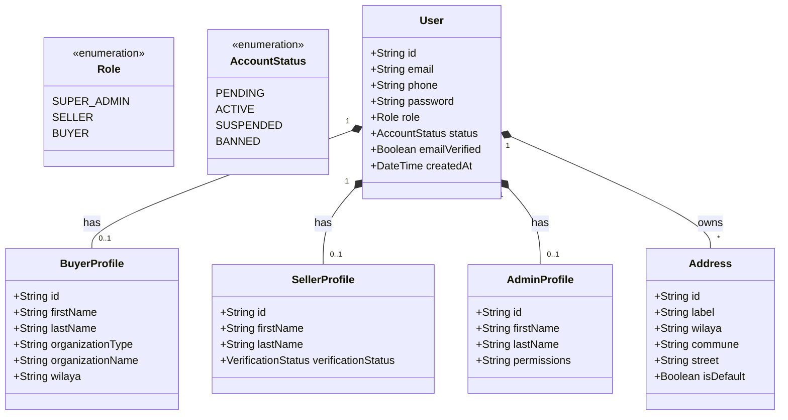
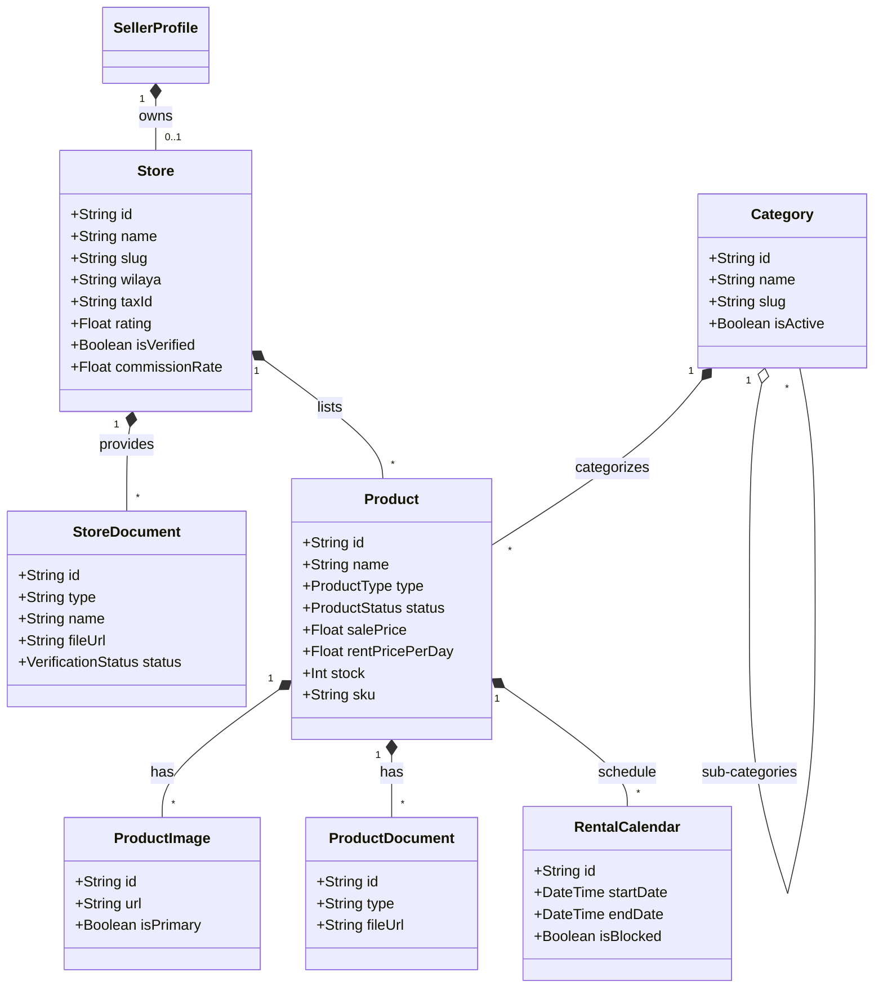
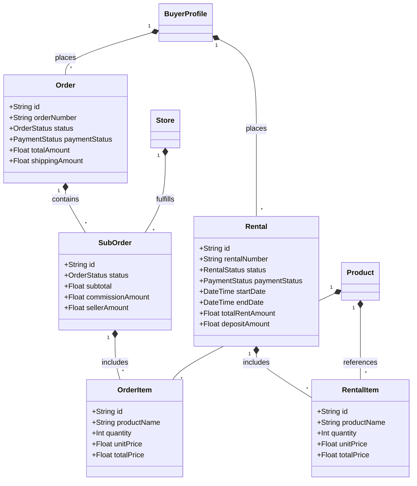
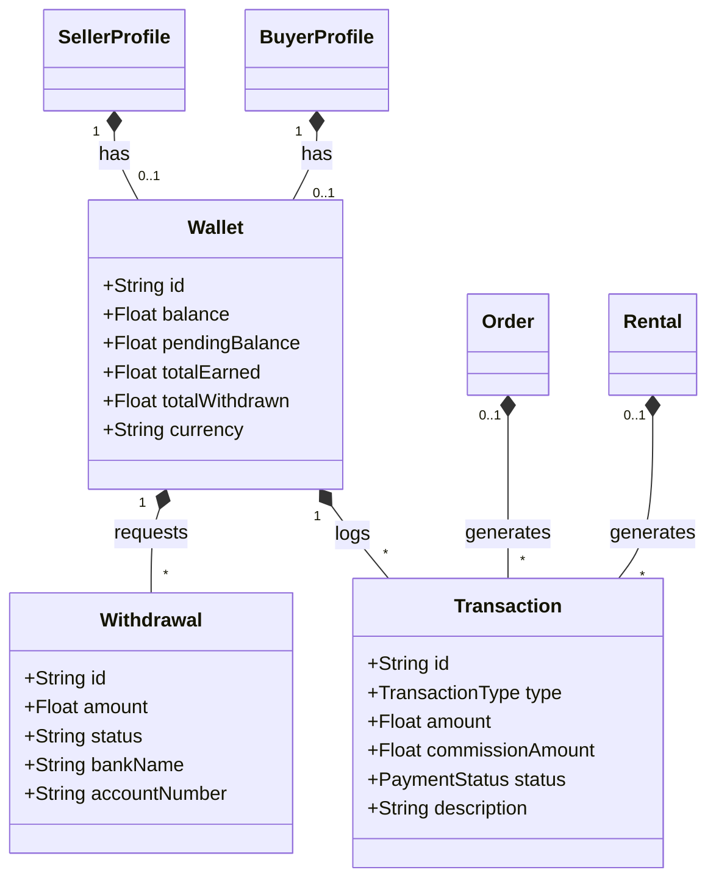
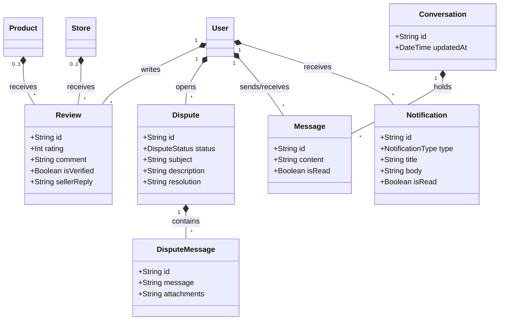

# Comprehensive Database Schema (Class Diagram) - MediShop Pro

Due to the size of the system and the multitude of relationships, the comprehensive diagram has been divided into **5 main parts** to be clearer and more readable. This diagram is based on the backend database structure (Prisma Schema).

## 1. Users & Profiles Management
This diagram illustrates the core user entities, their profiles based on roles (Buyer, Seller, Admin), and their addresses.

---

## 2. Store & Catalog Management
This diagram illustrates the structure of stores, documents, categories, and products with all their details (images, documents, rental calendar).

---

## 3. Orders & Rentals
This diagram illustrates the lifecycle of purchases (Orders) and rentals (Rentals), and the division of the main order into sub-orders based on stores.

---

## 4. Finance & Wallets
This covers everything related to funds on the platform, from wallets (for seller and buyer), financial transactions, and withdrawals.

---

## 5. Support, Reviews & Communication
Includes the messaging system (Chat), reviews, disputes, as well as notifications.

