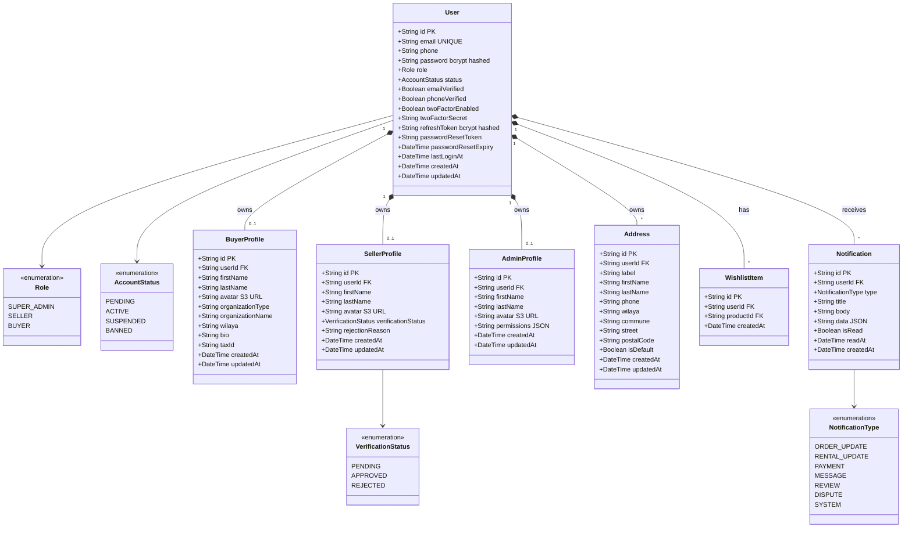
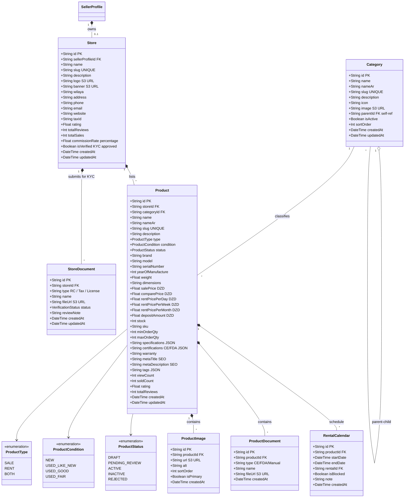
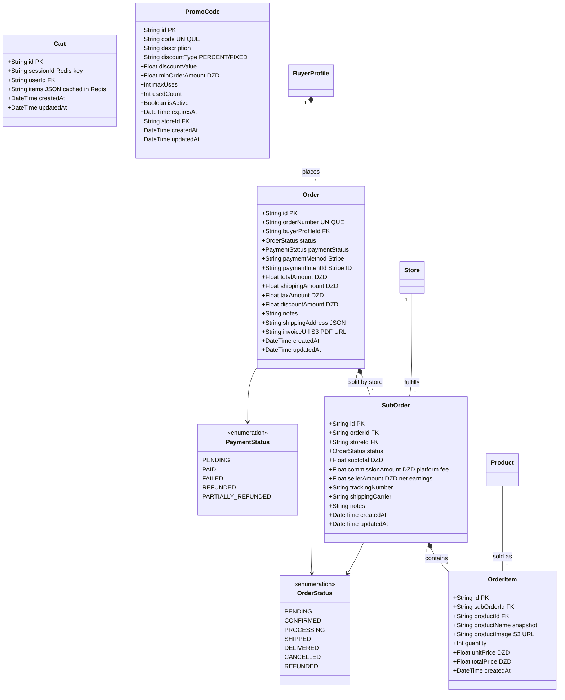
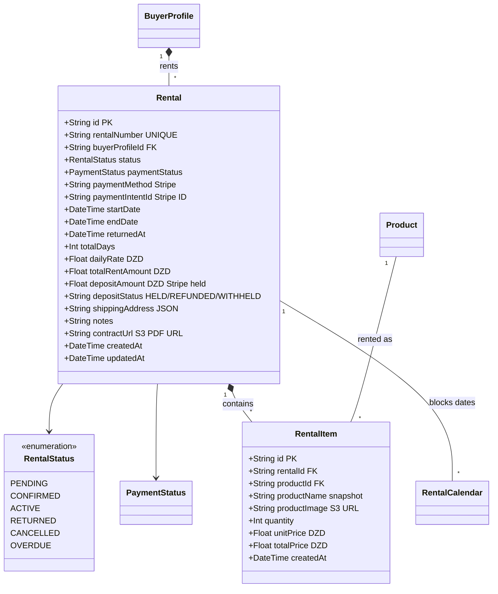
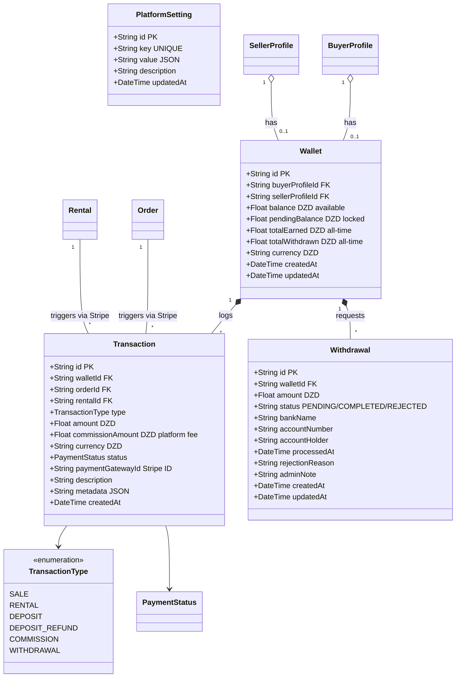
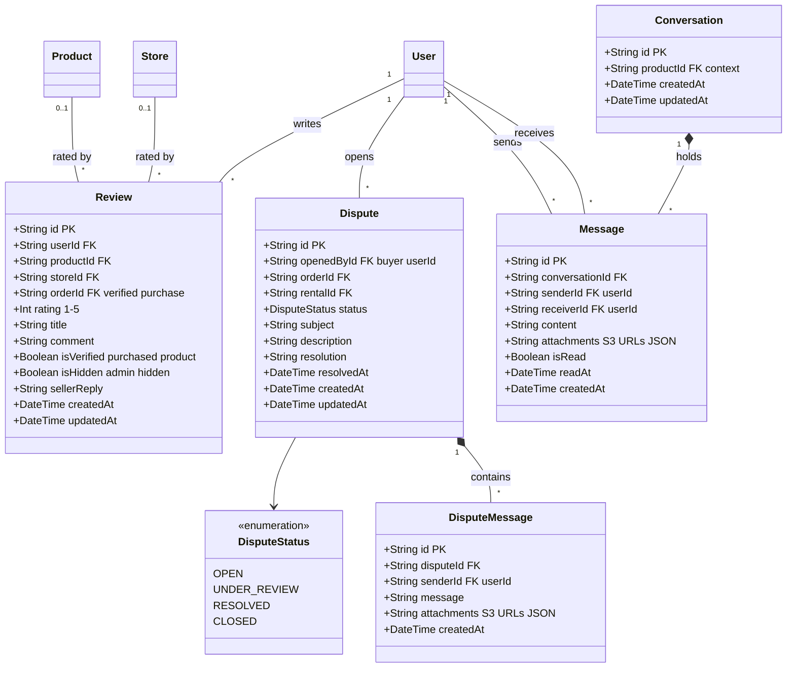

# 📐 Class Diagram — MediShop Pro
## Complete Data Model — 28 Models / 11 Enums
## Database: PostgreSQL 15 + Prisma 7 ORM

---

## Module 1 — Users & Authentication

---

## Module 2 — Stores & Product Catalog

---

## Module 3 — Orders, Cart & Split Payments

---

## Module 4 — Rentals & Deposit Management

---

## Module 5 — Finance, Wallet & Commission System

---

## Module 6 — Support, Reviews & Messaging

---

## 📊 Complete Data Model Summary

| Module | Models | Enums | Key Tech |
|--------|--------|-------|---------|
| 🔵 Users & Auth | 7 models | 4 enums | bcrypt, JWT HttpOnly, Rate Limit Redis |
| 🟡 Stores & Catalog | 7 models | 3 enums | S3 images/docs, KYC verification |
| 🟠 Orders & Cart | 5 models | 2 enums | Redis Cart, Stripe Split Payments |
| 🟢 Rentals | 3 models | 1 enum | Stripe Deposit, S3 Contract PDF |
| 🔴 Finance | 4 models | 1 enum | Commission system, Stripe, Wallet |
| 🟣 Support & Messaging | 5 models | 1 enum | S3 attachments, Dispute resolution |
| **Total** | **28 Models** | **11 Enums** | **PostgreSQL 15 + Prisma 7** |
