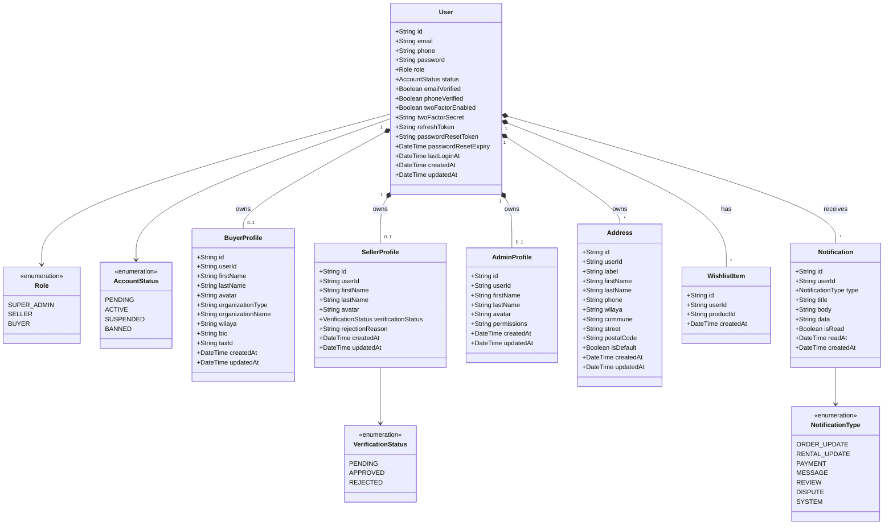
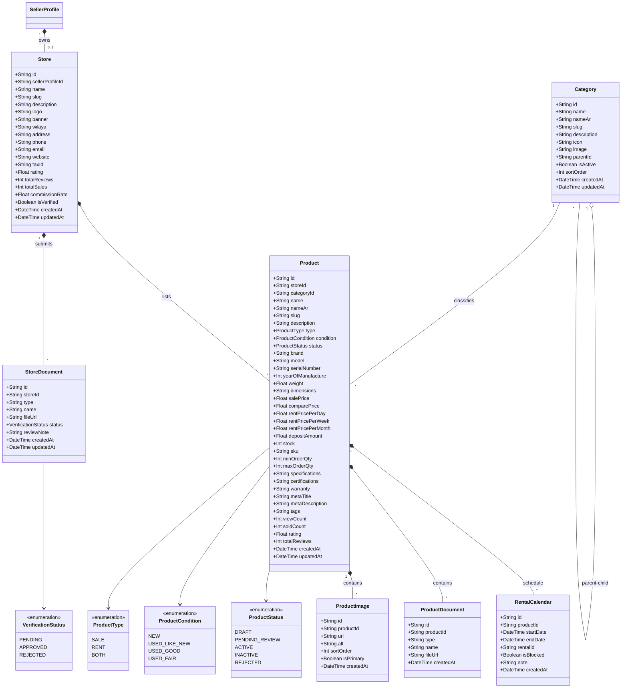
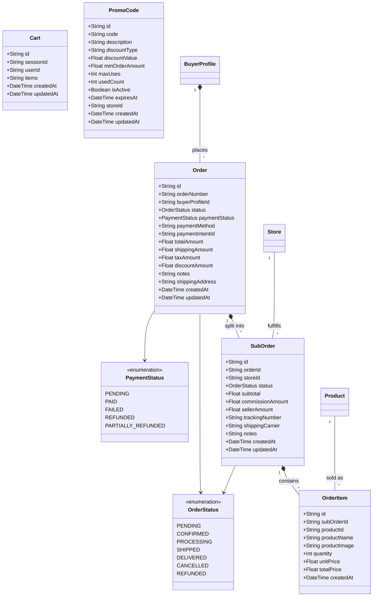
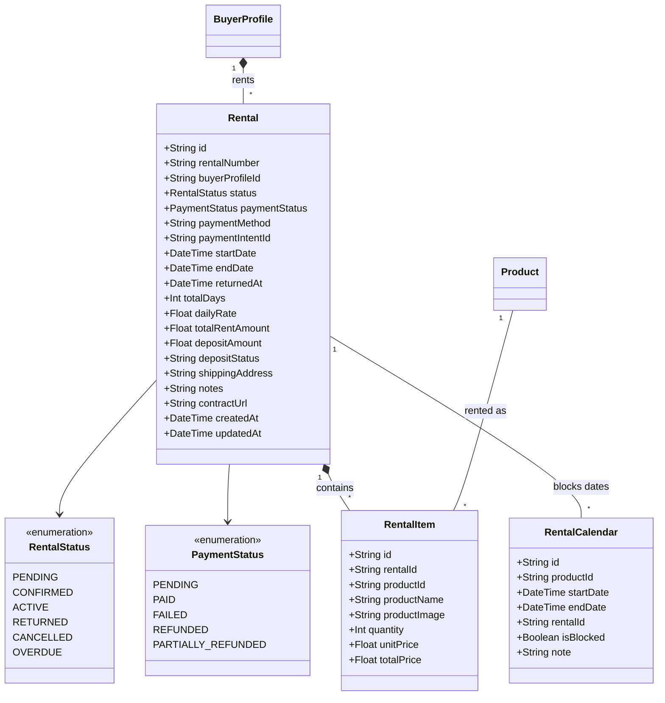
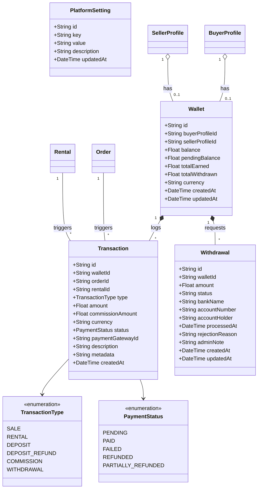
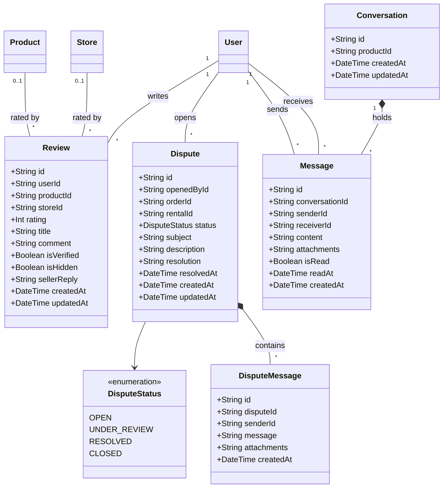

# 📐 Diagramme de Classes — MediShop Pro
### Système complet divisé en 6 modules

---

## 🔵 Module 1 — Utilisateurs & Authentification

> Gère tous les comptes, rôles, profils et adresses.

---

## 🟡 Module 2 — Boutiques & Catalogue Produits

> Gère les magasins des vendeurs, leurs documents légaux, les catégories et les produits.

---

## 🟠 Module 3 — Commandes & Panier

> Gère le cycle de vie des achats : panier, commande principale, sous-commandes par vendeur et articles.

---

## 🟢 Module 4 — Locations (Rentals)

> Gère le cycle de vie des locations : réservation, durée, dépôt de garantie et retour.

---

## 🔴 Module 5 — Finance, Portefeuille & Transactions

> Gère les wallets (vendeur/acheteur), toutes les transactions financières et les demandes de retrait.

---

## 🟣 Module 6 — Support, Avis & Messagerie

> Gère les avis clients, les litiges (disputes), la messagerie interne et les messages de litige.

---

## 📊 Résumé du Système

| Module | Entités | Enums |
|--------|---------|-------|
| 🔵 Utilisateurs & Auth | `User`, `BuyerProfile`, `SellerProfile`, `AdminProfile`, `Address`, `WishlistItem`, `Notification` | `Role`, `AccountStatus`, `VerificationStatus`, `NotificationType` |
| 🟡 Boutiques & Catalogue | `Store`, `StoreDocument`, `Category`, `Product`, `ProductImage`, `ProductDocument`, `RentalCalendar` | `ProductType`, `ProductCondition`, `ProductStatus` |
| 🟠 Commandes & Panier | `Cart`, `Order`, `SubOrder`, `OrderItem`, `PromoCode` | `OrderStatus`, `PaymentStatus` |
| 🟢 Locations | `Rental`, `RentalItem`, `RentalCalendar` | `RentalStatus`, `PaymentStatus` |
| 🔴 Finance | `Wallet`, `Transaction`, `Withdrawal`, `PlatformSetting` | `TransactionType`, `PaymentStatus` |
| 🟣 Support & Messagerie | `Review`, `Dispute`, `DisputeMessage`, `Conversation`, `Message` | `DisputeStatus` |
| **Total** | **28 Modèles** | **11 Enums** |
