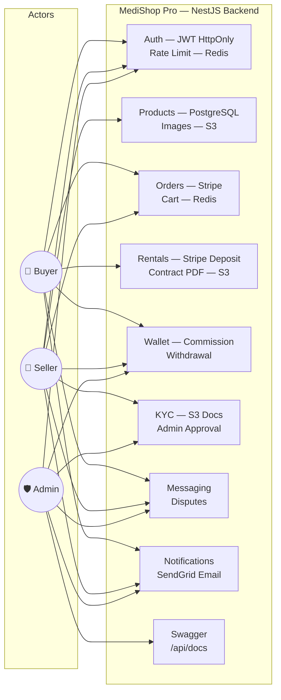

# 🎯 Use Case Diagram — MediShop Pro
## All Actors & Use Cases (Updated: KYC + Stripe + Redis + S3 + Swagger)

---

## Use Case 1 — Buyer Actions

```mermaid
graph TD
  BUYER((👤 BUYER))

  subgraph "🛒 Product Discovery"
    UC_B1[Browse Product Catalog]
    UC_B2[Search Products by Keyword]
    UC_B3[Filter by Category / Wilaya / Price / Condition]
    UC_B4[View Product Details + CE/FDA Certifications]
    UC_B5[View Store Profile & Rating]
    UC_B6[Add Product to Wishlist]
  end

  subgraph "🛒 Cart — Redis Cached"
    UC_B7[Add Product to Cart]
    UC_B8[Update Cart Quantities]
    UC_B9[Remove from Cart]
    UC_B10[Apply Promo Code]
  end

  subgraph "💳 Purchase & Stripe Checkout"
    UC_B11[Checkout with Stripe Payment]
    UC_B12[Select Shipping Address]
    UC_B13[Confirm Payment via Stripe.js]
    UC_B14[Download Tax Invoice PDF from S3]
    UC_B15[Track Order Status Step-by-Step]
    UC_B16[Confirm Order Delivery]
    UC_B17[Cancel Order Before Shipment]
    UC_B18[Request Refund via Stripe]
  end

  subgraph "🔧 Equipment Rental"
    UC_B19[Browse Rental Products]
    UC_B20[Check Rental Calendar Availability]
    UC_B21[Place Rental + Pay Deposit via Stripe]
    UC_B22[Download Rental Contract PDF from S3]
    UC_B23[Track Rental Status]
    UC_B24[Return Equipment]
    UC_B25[Receive Deposit Refund via Stripe]
  end

  subgraph "💬 Communication & Support"
    UC_B26[Send Message to Seller]
    UC_B27[Open Dispute on Order / Rental]
    UC_B28[Send Dispute Evidence / Messages]
    UC_B29[Write Product Review + Rating]
    UC_B30[Write Store Review + Rating]
    UC_B31[Receive Email Notifications via SendGrid]
  end

  subgraph "👤 Account Management"
    UC_B32[Register as Buyer]
    UC_B33[Verify Email via SendGrid]
    UC_B34[Login — JWT + HttpOnly Cookie]
    UC_B35[Logout — Clear Cookie + Token]
    UC_B36[Edit Profile & Avatar → S3]
    UC_B37[Manage Saved Addresses]
    UC_B38[View Wallet Balance]
    UC_B39[Reset Password via Email]
    UC_B40[Enable Two-Factor Authentication]
  end

  BUYER --> UC_B1 & UC_B2 & UC_B3 & UC_B4 & UC_B5 & UC_B6
  BUYER --> UC_B7 & UC_B8 & UC_B9 & UC_B10
  BUYER --> UC_B11 & UC_B12 & UC_B13 & UC_B14 & UC_B15 & UC_B16 & UC_B17 & UC_B18
  BUYER --> UC_B19 & UC_B20 & UC_B21 & UC_B22 & UC_B23 & UC_B24 & UC_B25
  BUYER --> UC_B26 & UC_B27 & UC_B28 & UC_B29 & UC_B30 & UC_B31
  BUYER --> UC_B32 & UC_B33 & UC_B34 & UC_B35 & UC_B36 & UC_B37 & UC_B38 & UC_B39 & UC_B40
```

---

## Use Case 2 — Seller Actions

```mermaid
graph TD
  SELLER((🏪 SELLER))

  subgraph "🏬 KYC & Store Setup"
    UC_S1[Register as Seller]
    UC_S2[Verify Email via SendGrid]
    UC_S3[Create & Setup Store Profile]
    UC_S4[Upload KYC Legal Documents to S3\nRC / Tax / Health Ministry License]
    UC_S5[Submit Store for Admin KYC Review]
    UC_S6[Edit Store Logo & Banner → S3]
    UC_S7[View Store Analytics & Sales Stats]
    UC_S8[Create Promo Codes]
  end

  subgraph "📦 Product Management"
    UC_S9[Add New Product — Sale / Rent / Both]
    UC_S10[Upload Product Images → S3]
    UC_S11[Upload CE/FDA Certifications PDF → S3]
    UC_S12[Edit Product Details & Pricing]
    UC_S13[Set Rental Prices — Daily/Weekly/Monthly]
    UC_S14[Set Rental Calendar & Block Dates]
    UC_S15[Manage Product Stock]
    UC_S16[Activate / Deactivate Product]
    UC_S17[Reply to Customer Reviews]
  end

  subgraph "📬 Order Management"
    UC_S18[View Incoming Orders Dashboard]
    UC_S19[Confirm & Process SubOrder]
    UC_S20[Add Tracking Number & Carrier]
    UC_S21[Mark SubOrder as Shipped]
    UC_S22[Handle Rental Confirmations]
    UC_S23[Mark Equipment as Returned]
  end

  subgraph "💰 Wallet & Finance"
    UC_S24[View Wallet — Balance & PendingBalance]
    UC_S25[View Commission Deductions]
    UC_S26[View Full Transaction History]
    UC_S27[Request Withdrawal — Bank Transfer]
    UC_S28[Receive Payment Notifications via SendGrid]
  end

  subgraph "💬 Communication"
    UC_S29[Message Buyers Directly]
    UC_S30[Respond to Disputes]
    UC_S31[Receive Email Alerts via SendGrid]
  end

  SELLER --> UC_S1 & UC_S2 & UC_S3 & UC_S4 & UC_S5 & UC_S6 & UC_S7 & UC_S8
  SELLER --> UC_S9 & UC_S10 & UC_S11 & UC_S12 & UC_S13 & UC_S14 & UC_S15 & UC_S16 & UC_S17
  SELLER --> UC_S18 & UC_S19 & UC_S20 & UC_S21 & UC_S22 & UC_S23
  SELLER --> UC_S24 & UC_S25 & UC_S26 & UC_S27 & UC_S28
  SELLER --> UC_S29 & UC_S30 & UC_S31
```

---

## Use Case 3 — Super Admin Actions

```mermaid
graph TD
  ADMIN((🛡️ SUPER ADMIN))

  subgraph "👥 User Management"
    UC_A1[View All Users in PostgreSQL]
    UC_A2[Suspend / Ban User Account]
    UC_A3[Activate Suspended Account]
    UC_A4[View Full User Profile & Role]
    UC_A5[Reset User Password]
  end

  subgraph "🏬 KYC Store Verification"
    UC_A6[View Pending Store Applications]
    UC_A7[Download & Review KYC Docs from S3]
    UC_A8[Approve Store — isVerified: true]
    UC_A9[Reject Store with Written Reason]
    UC_A10[View All Active Stores]
    UC_A11[Manage Commission Rate per Store]
  end

  subgraph "📦 Product Moderation"
    UC_A12[View Products Pending Review]
    UC_A13[Download CE/FDA Certifications from S3]
    UC_A14[Approve Product — status: ACTIVE]
    UC_A15[Reject Product with Reason]
    UC_A16[Remove Active Product from Platform]
  end

  subgraph "📊 Orders & Rentals Oversight"
    UC_A17[View All Platform Orders]
    UC_A18[View All Platform Rentals]
    UC_A19[Manually Cancel Order]
    UC_A20[Process Stripe Refund]
  end

  subgraph "💰 Finance & Commission Management"
    UC_A21[View All Wallet Transactions]
    UC_A22[Review Pending Withdrawals]
    UC_A23[Approve Withdrawal — Bank Transfer]
    UC_A24[Reject Withdrawal with Reason]
    UC_A25[View Platform Revenue & Total Commissions]
    UC_A26[Set Global Commission Rate\nin PlatformSettings]
  end

  subgraph "⚖️ Dispute Resolution Center"
    UC_A27[View All Open Disputes]
    UC_A28[Read All Dispute Messages & Evidence]
    UC_A29[Resolve Dispute — Issue Stripe Refund to Buyer]
    UC_A30[Resolve Dispute — Release Funds to Seller]
    UC_A31[Close Dispute]
  end

  subgraph "⚙️ Platform Settings & Swagger"
    UC_A32[Edit Platform Global Settings\nPlatformSetting table]
    UC_A33[Manage Product Categories Hierarchy]
    UC_A34[View Analytics Dashboard & KPIs]
    UC_A35[Broadcast System Notifications via SendGrid]
    UC_A36[Access Swagger / OpenAPI Docs at /api/docs]
  end

  ADMIN --> UC_A1 & UC_A2 & UC_A3 & UC_A4 & UC_A5
  ADMIN --> UC_A6 & UC_A7 & UC_A8 & UC_A9 & UC_A10 & UC_A11
  ADMIN --> UC_A12 & UC_A13 & UC_A14 & UC_A15 & UC_A16
  ADMIN --> UC_A17 & UC_A18 & UC_A19 & UC_A20
  ADMIN --> UC_A21 & UC_A22 & UC_A23 & UC_A24 & UC_A25 & UC_A26
  ADMIN --> UC_A27 & UC_A28 & UC_A29 & UC_A30 & UC_A31
  ADMIN --> UC_A32 & UC_A33 & UC_A34 & UC_A35 & UC_A36
```

---

## 📋 Use Case Summary Table

| Actor | Total Use Cases | Key Technologies |
|-------|----------------|-----------------|
| 👤 **Buyer** | 40 | Stripe, Redis Cart, S3 Invoices, SendGrid |
| 🏪 **Seller** | 31 | S3 KYC/Images, SendGrid, Wallet, Stripe |
| 🛡️ **Super Admin** | 36 | KYC Review, Stripe Refund, Commission Mgmt, Swagger |
| **Total** | **107** | PostgreSQL + Redis + S3 + Stripe + SendGrid |

---

## 🔗 System Actors & External Services

