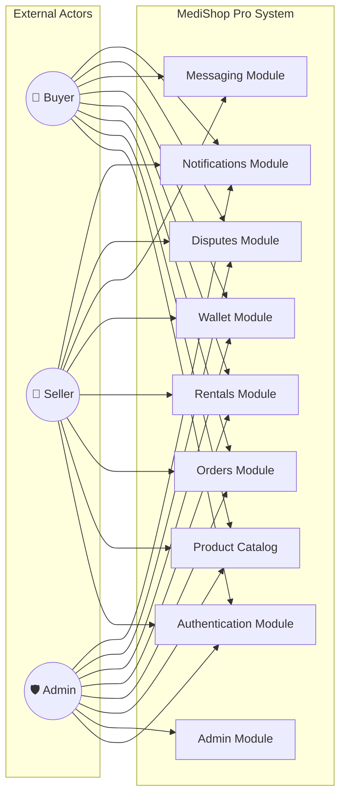

# 🎯 Use Case Diagram — MediShop Pro
## Medical Equipment Marketplace

> This diagram illustrates all the use cases for each actor in the system: **Buyer**, **Seller**, and **Super Admin**. It covers the complete set of interactions available on the platform.

---

## 🔵 Use Case 1 — Buyer Actions

```mermaid
graph TD
  BUYER((👤 BUYER))

  subgraph "🛒 Product Discovery"
    UC_B1[Browse Products Catalog]
    UC_B2[Search Products by Keyword]
    UC_B3[Filter by Category / Wilaya / Price]
    UC_B4[View Product Details]
    UC_B5[View Store Profile]
    UC_B6[Add Product to Wishlist]
    UC_B7[Add Product to Cart]
  end

  subgraph "📦 Purchase & Orders"
    UC_B8[Checkout & Place Order]
    UC_B9[Apply Promo Code]
    UC_B10[Select Shipping Address]
    UC_B11[Track Order Status]
    UC_B12[Confirm Order Delivery]
    UC_B13[Cancel Order]
    UC_B14[Request Refund]
  end

  subgraph "🔧 Equipment Rental"
    UC_B15[Browse Rental Products]
    UC_B16[Check Rental Availability Calendar]
    UC_B17[Place Rental Request]
    UC_B18[Track Rental Status]
    UC_B19[Return Equipment]
    UC_B20[Pay Security Deposit]
    UC_B21[Receive Deposit Refund]
  end

  subgraph "💬 Communication & Support"
    UC_B22[Send Message to Seller]
    UC_B23[Receive Messages]
    UC_B24[Open a Dispute on Order]
    UC_B25[Send Dispute Message]
    UC_B26[Write a Product Review]
    UC_B27[Write a Store Review]
    UC_B28[Receive Notifications]
  end

  subgraph "👤 Account Management"
    UC_B29[Register as Buyer]
    UC_B30[Login / Logout]
    UC_B31[Edit Profile & Avatar]
    UC_B32[Manage Saved Addresses]
    UC_B33[View Wallet Balance]
    UC_B34[Reset Password]
    UC_B35[Enable Two-Factor Authentication]
  end

  BUYER --> UC_B1
  BUYER --> UC_B2
  BUYER --> UC_B3
  BUYER --> UC_B4
  BUYER --> UC_B5
  BUYER --> UC_B6
  BUYER --> UC_B7
  BUYER --> UC_B8
  BUYER --> UC_B9
  BUYER --> UC_B10
  BUYER --> UC_B11
  BUYER --> UC_B12
  BUYER --> UC_B13
  BUYER --> UC_B14
  BUYER --> UC_B15
  BUYER --> UC_B16
  BUYER --> UC_B17
  BUYER --> UC_B18
  BUYER --> UC_B19
  BUYER --> UC_B20
  BUYER --> UC_B21
  BUYER --> UC_B22
  BUYER --> UC_B23
  BUYER --> UC_B24
  BUYER --> UC_B25
  BUYER --> UC_B26
  BUYER --> UC_B27
  BUYER --> UC_B28
  BUYER --> UC_B29
  BUYER --> UC_B30
  BUYER --> UC_B31
  BUYER --> UC_B32
  BUYER --> UC_B33
  BUYER --> UC_B34
  BUYER --> UC_B35
```

---

## 🟡 Use Case 2 — Seller Actions

```mermaid
graph TD
  SELLER((🏪 SELLER))

  subgraph "🏬 Store Management"
    UC_S1[Register as Seller]
    UC_S2[Create & Setup Store]
    UC_S3[Upload Legal Documents]
    UC_S4[Edit Store Profile / Logo / Banner]
    UC_S5[View Store Analytics]
    UC_S6[Set Commission Rate]
    UC_S7[Create Promo Codes]
  end

  subgraph "📦 Product Management"
    UC_S8[Add New Product — Sale / Rent / Both]
    UC_S9[Upload Product Images & Documents]
    UC_S10[Edit Product Details & Pricing]
    UC_S11[Manage Product Stock]
    UC_S12[Set Rental Calendar & Blocked Dates]
    UC_S13[Activate / Deactivate Product]
    UC_S14[View Product Reviews]
    UC_S15[Reply to Customer Review]
  end

  subgraph "📬 Order Management"
    UC_S16[View Incoming Orders]
    UC_S17[Confirm / Process Order]
    UC_S18[Add Tracking Number]
    UC_S19[Mark Order as Shipped]
    UC_S20[View Order History]
  end

  subgraph "🔧 Rental Management"
    UC_S21[View Incoming Rental Requests]
    UC_S22[Confirm Rental]
    UC_S23[Mark Equipment as Returned]
    UC_S24[Manage Rental Calendar]
  end

  subgraph "💰 Finance & Wallet"
    UC_S25[View Wallet Balance & Earnings]
    UC_S26[View Pending Balance]
    UC_S27[Request Withdrawal]
    UC_S28[View Transaction History]
    UC_S29[View Commission Deductions]
  end

  subgraph "💬 Communication"
    UC_S30[Message Buyer Directly]
    UC_S31[Respond to Disputes]
    UC_S32[Receive Notifications]
  end

  SELLER --> UC_S1
  SELLER --> UC_S2
  SELLER --> UC_S3
  SELLER --> UC_S4
  SELLER --> UC_S5
  SELLER --> UC_S6
  SELLER --> UC_S7
  SELLER --> UC_S8
  SELLER --> UC_S9
  SELLER --> UC_S10
  SELLER --> UC_S11
  SELLER --> UC_S12
  SELLER --> UC_S13
  SELLER --> UC_S14
  SELLER --> UC_S15
  SELLER --> UC_S16
  SELLER --> UC_S17
  SELLER --> UC_S18
  SELLER --> UC_S19
  SELLER --> UC_S20
  SELLER --> UC_S21
  SELLER --> UC_S22
  SELLER --> UC_S23
  SELLER --> UC_S24
  SELLER --> UC_S25
  SELLER --> UC_S26
  SELLER --> UC_S27
  SELLER --> UC_S28
  SELLER --> UC_S29
  SELLER --> UC_S30
  SELLER --> UC_S31
  SELLER --> UC_S32
```

---

## 🔴 Use Case 3 — Super Admin Actions

```mermaid
graph TD
  ADMIN((🛡️ SUPER ADMIN))

  subgraph "👥 User Management"
    UC_A1[View All Users]
    UC_A2[Suspend / Ban User Account]
    UC_A3[Activate User Account]
    UC_A4[View User Profile Details]
    UC_A5[Reset User Password]
  end

  subgraph "🏬 Store Verification"
    UC_A6[View Pending Store Applications]
    UC_A7[Review Store Legal Documents]
    UC_A8[Approve Store — isVerified = true]
    UC_A9[Reject Store with Reason]
    UC_A10[View All Active Stores]
  end

  subgraph "📦 Product Moderation"
    UC_A11[View Pending Products]
    UC_A12[Approve Product — ACTIVE]
    UC_A13[Reject Product with Reason]
    UC_A14[Hide / Remove Active Product]
    UC_A15[View All Product Catalog]
  end

  subgraph "📊 Orders & Rentals"
    UC_A16[View All Platform Orders]
    UC_A17[View All Platform Rentals]
    UC_A18[Manually Cancel Order]
    UC_A19[Process Refund]
  end

  subgraph "💰 Finance Management"
    UC_A20[View All Transactions]
    UC_A21[View Pending Withdrawals]
    UC_A22[Approve Withdrawal]
    UC_A23[Reject Withdrawal with Reason]
    UC_A24[View Platform Revenue & Commissions]
    UC_A25[Manage Platform Commission Rate]
  end

  subgraph "⚖️ Dispute Resolution"
    UC_A26[View All Open Disputes]
    UC_A27[Read Dispute Messages]
    UC_A28[Resolve Dispute in favor of Buyer / Seller]
    UC_A29[Close Dispute]
  end

  subgraph "⚙️ Platform Settings"
    UC_A30[Edit Platform Global Settings]
    UC_A31[Manage Product Categories]
    UC_A32[View Platform Analytics Dashboard]
    UC_A33[Broadcast System Notifications]
  end

  ADMIN --> UC_A1
  ADMIN --> UC_A2
  ADMIN --> UC_A3
  ADMIN --> UC_A4
  ADMIN --> UC_A5
  ADMIN --> UC_A6
  ADMIN --> UC_A7
  ADMIN --> UC_A8
  ADMIN --> UC_A9
  ADMIN --> UC_A10
  ADMIN --> UC_A11
  ADMIN --> UC_A12
  ADMIN --> UC_A13
  ADMIN --> UC_A14
  ADMIN --> UC_A15
  ADMIN --> UC_A16
  ADMIN --> UC_A17
  ADMIN --> UC_A18
  ADMIN --> UC_A19
  ADMIN --> UC_A20
  ADMIN --> UC_A21
  ADMIN --> UC_A22
  ADMIN --> UC_A23
  ADMIN --> UC_A24
  ADMIN --> UC_A25
  ADMIN --> UC_A26
  ADMIN --> UC_A27
  ADMIN --> UC_A28
  ADMIN --> UC_A29
  ADMIN --> UC_A30
  ADMIN --> UC_A31
  ADMIN --> UC_A32
  ADMIN --> UC_A33
```

---

## 📋 Use Case Summary Table

| Actor | Total Use Cases | Key Domains |
|-------|----------------|-------------|
| 👤 **Buyer** | 35 | Shopping, Rentals, Disputes, Reviews, Account |
| 🏪 **Seller** | 32 | Store, Products, Orders, Wallet, Rentals |
| 🛡️ **Super Admin** | 33 | Users, Stores, Products, Finance, Disputes, Settings |
| **Total** | **100** | Complete Platform Coverage |

---

## 🔗 System Actors Relationship

