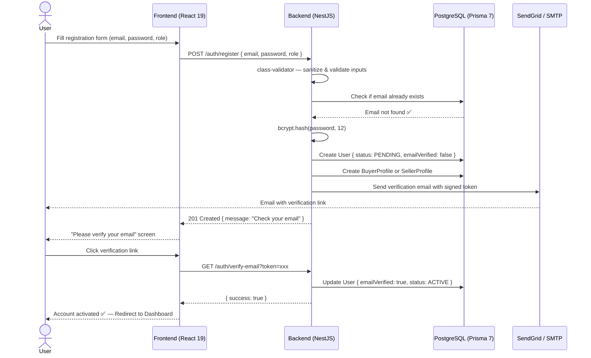
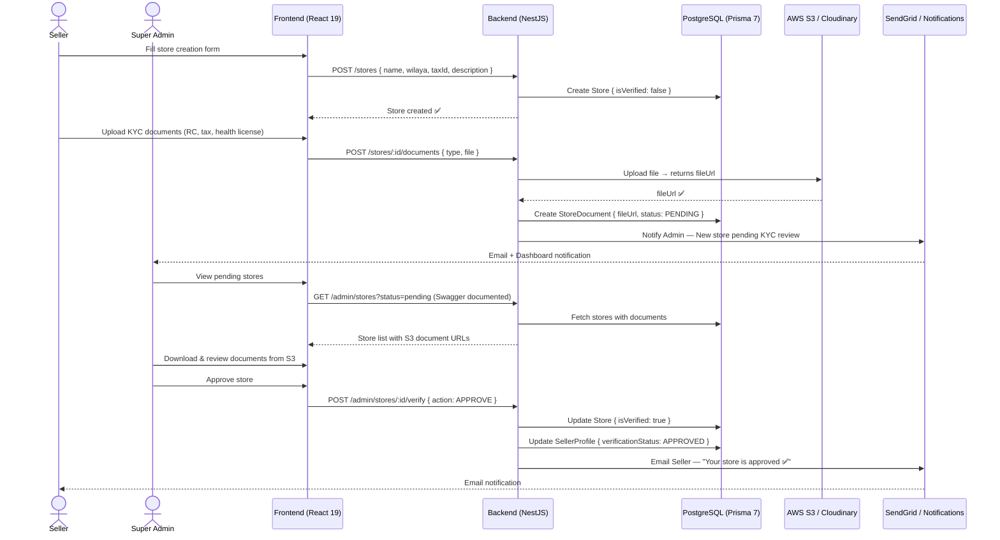
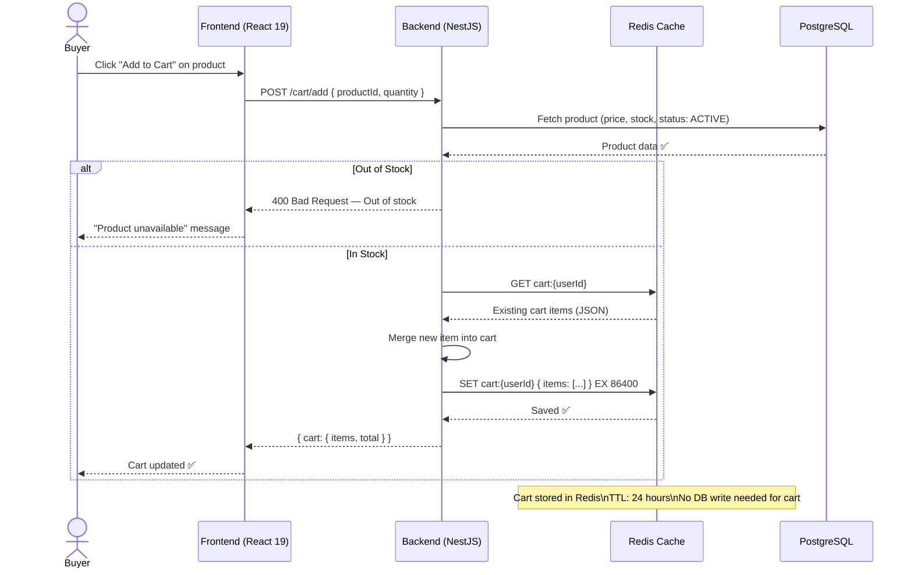
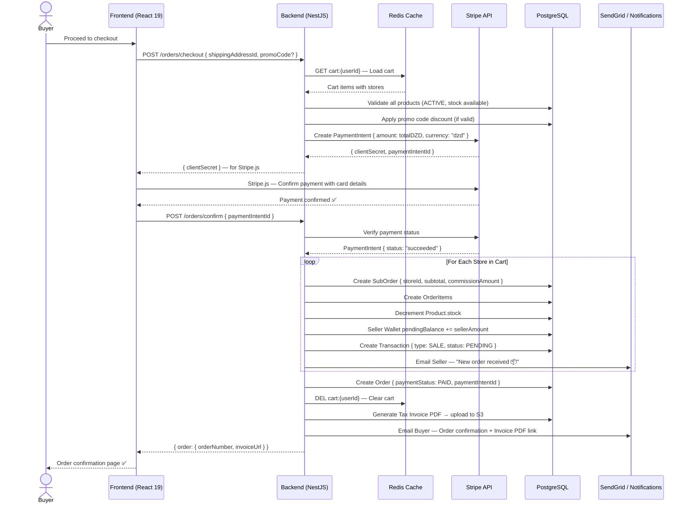
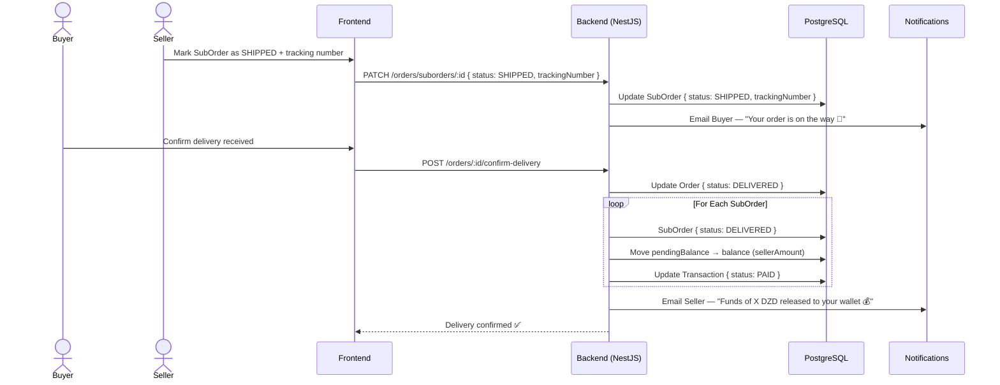
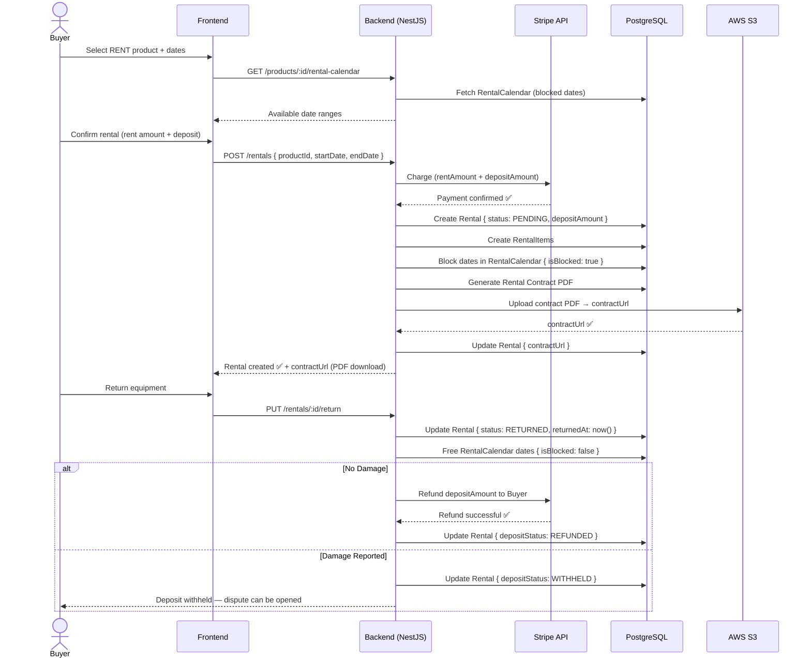
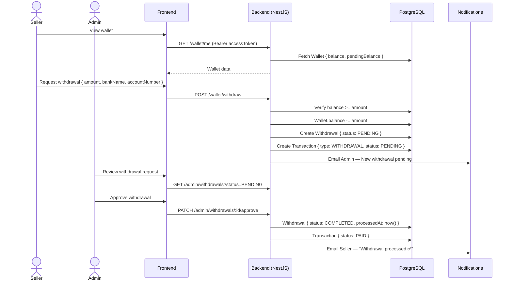
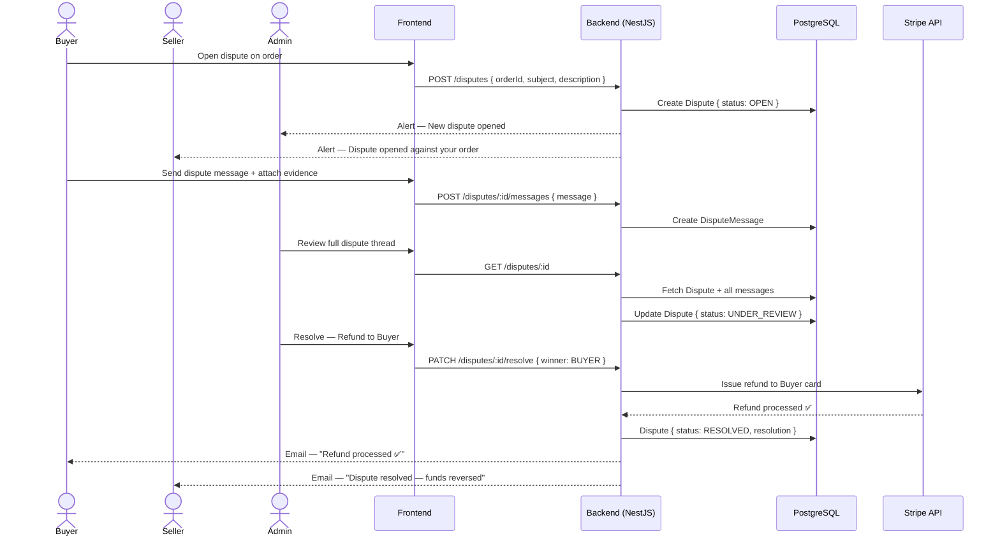

# 🔄 Sequence Diagrams — MediShop Pro
## All Main System Workflows (PostgreSQL + Redis + Stripe + HttpOnly Cookies)

---

## Sequence 1 — User Registration & Email Verification



---

## Sequence 2 — Secure Login (JWT + HttpOnly Cookie)

```mermaid
sequenceDiagram
  actor User
  participant Browser as Frontend (React 19)
  participant Redis as Redis Cache
  participant API as Backend (NestJS)
  participant DB as PostgreSQL (Prisma 7)

  User->>Browser: Enter email & password
  Browser->>API: POST /auth/login { email, password }

  API->>Redis: Check rate limit for this IP
  alt Too Many Attempts (> 5)
    Redis-->>API: BLOCKED
    API-->>Browser: 429 Too Many Requests — Wait 15 minutes
    Browser-->>User: Account temporarily locked 🔒
  else Attempts OK
    Redis-->>API: Allowed ✅
    API->>DB: Find User by email
    DB-->>API: User record
    API->>API: bcrypt.compare(password, hash)
    alt Wrong Password
      API->>Redis: Increment fail counter for IP
      API-->>Browser: 401 Unauthorized
      Browser-->>User: "Invalid credentials" error
    else Correct Password
      API->>DB: Update User { lastLoginAt: now() }
      API->>API: Sign accessToken (15min) — JWT_SECRET
      API->>API: Sign refreshToken (7 days) — REFRESH_SECRET
      API->>DB: Save bcrypt(refreshToken) in User record
      API-->>Browser: Set-Cookie: refreshToken=xxx; HttpOnly; Secure; SameSite=Strict
      API-->>Browser: { accessToken, user: { id, role, email } }
      Browser->>Browser: Store accessToken in memory (not localStorage)
      Browser-->>User: Redirect to role-based Dashboard
    end
  end
```

---

## Sequence 3 — Seller KYC & Store Approval



---

## Sequence 4 — Add to Cart (Redis Cached)



---

## Sequence 5 — Multi-Vendor Checkout & Stripe Payment



---

## Sequence 6 — Delivery Confirmation & Wallet Release



---

## Sequence 7 — Equipment Rental with Deposit



---

## Sequence 8 — Seller Withdrawal



---

## Sequence 9 — Dispute Opening & Resolution



---

## Sequence 10 — Token Refresh (HttpOnly Cookie)

```mermaid
sequenceDiagram
  participant Browser as Frontend (React 19)
  participant API as Backend (NestJS)
  participant DB as PostgreSQL

  Browser->>API: GET /products (expired accessToken in header)
  API-->>Browser: 401 Unauthorized — Token expired

  Browser->>API: POST /auth/refresh\n(refreshToken sent automatically via HttpOnly Cookie)
  API->>API: Read refreshToken from Cookie (not body — XSS safe)
  API->>DB: Find User with matching refreshToken hash
  API->>API: bcrypt.compare(cookieToken, dbHash)

  alt Valid Refresh Token
    API->>API: Sign new accessToken (15min)
    API->>API: Rotate refreshToken (7 days)
    API->>DB: Update User { refreshToken: newHash }
    API-->>Browser: Set-Cookie: refreshToken=newToken; HttpOnly; Secure
    API-->>Browser: { accessToken: newAccessToken }
    Browser->>Browser: Update accessToken in memory
    Browser->>API: Retry GET /products with new accessToken
    API-->>Browser: Products data ✅
  else Expired or Tampered
    API->>DB: Clear refreshToken from User
    API-->>Browser: 401 — Session expired
    Browser->>Browser: Redirect to Login page
  end
```
