# 🔄 Sequence Diagrams — MediShop Pro
## All Main System Workflows — Interaction Over Time

---

## Sequence 1 — User Registration & Email Verification

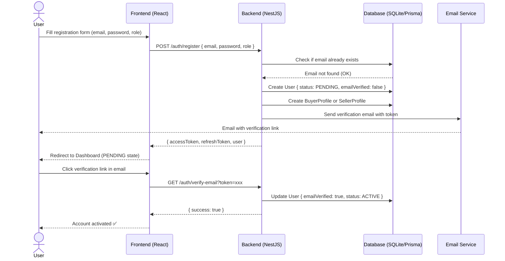

---

## Sequence 2 — User Login & JWT Authentication

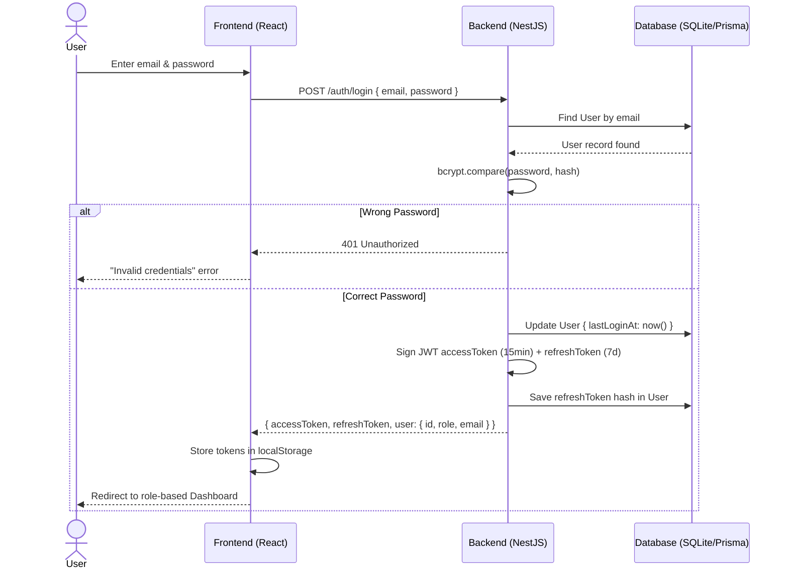

---

## Sequence 3 — Seller Store Creation & Admin Approval

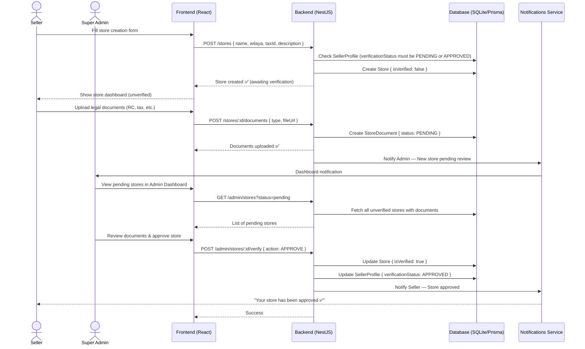

---

## Sequence 4 — Product Listing & Admin Approval

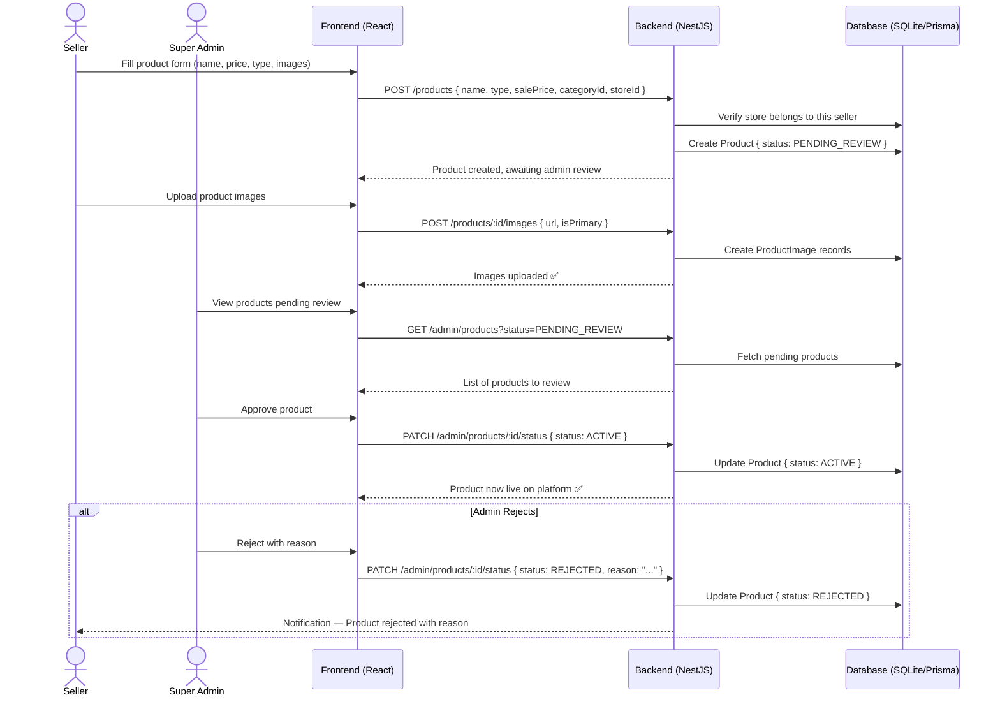

---

## Sequence 5 — Multi-Vendor Purchase & Checkout

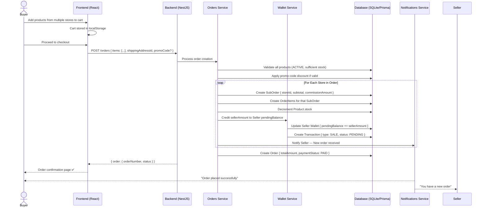

---

## Sequence 6 — Order Delivery Confirmation & Wallet Release

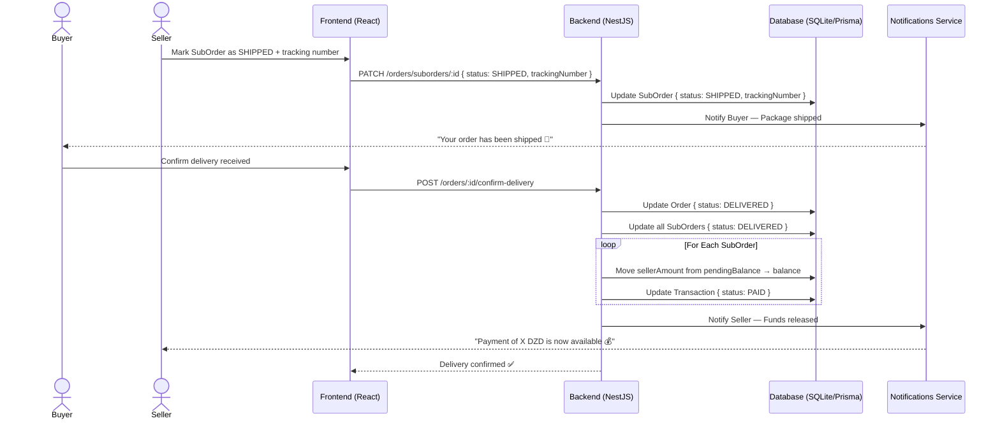

---

## Sequence 7 — Equipment Rental Lifecycle

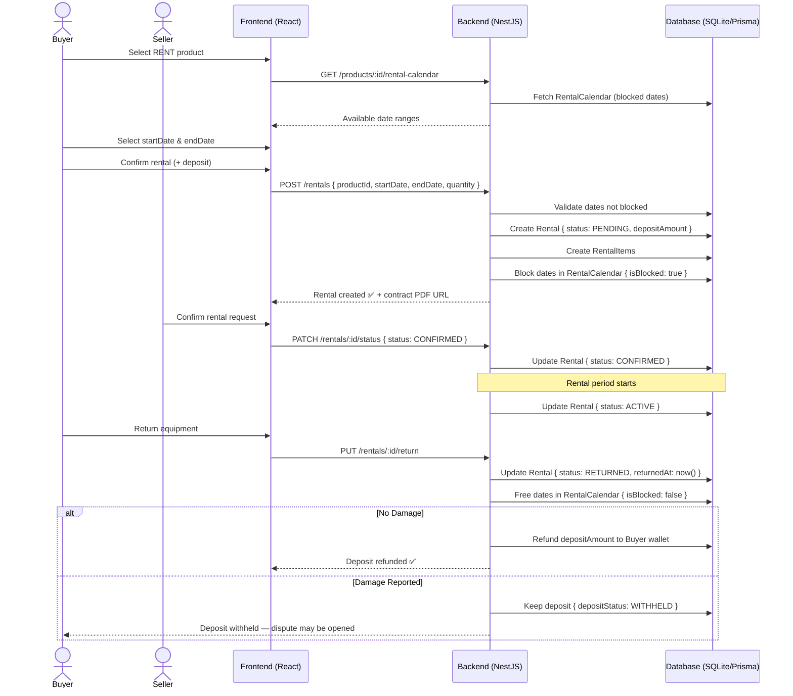

---

## Sequence 8 — Seller Withdrawal Request

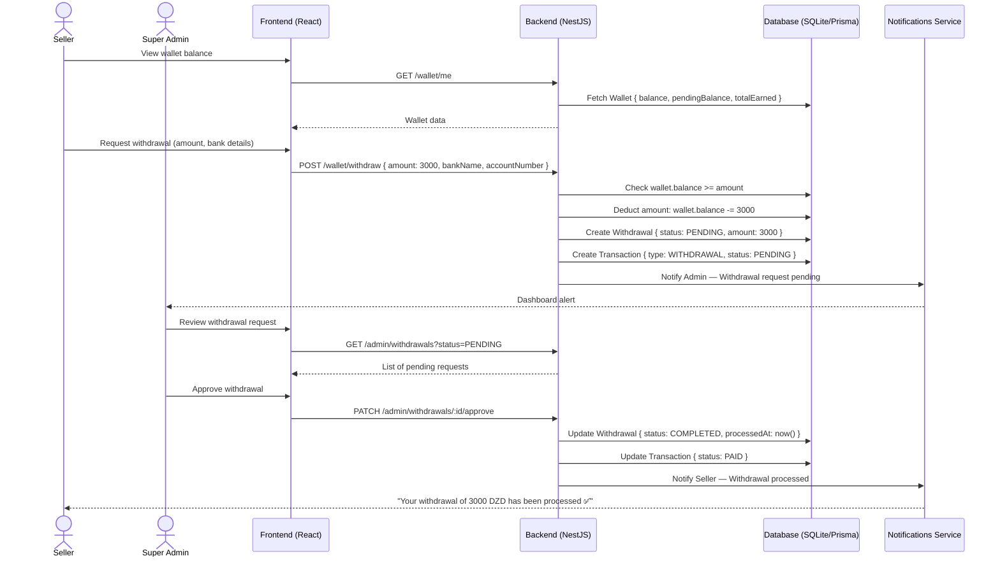

---

## Sequence 9 — Dispute Opening & Resolution

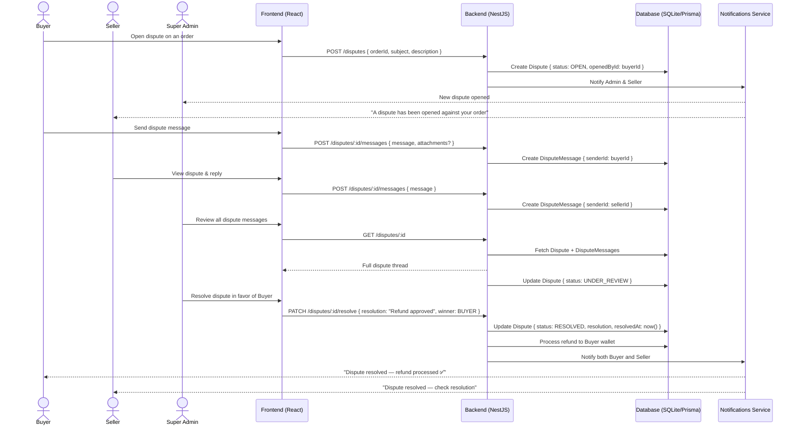

---

## Sequence 10 — Messaging Between Buyer & Seller

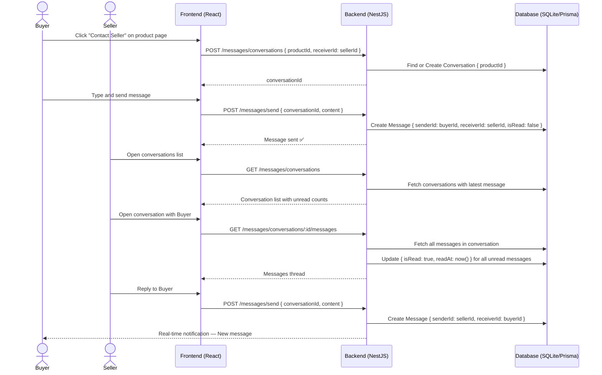

---

## Sequence 11 — Token Refresh & Session Management

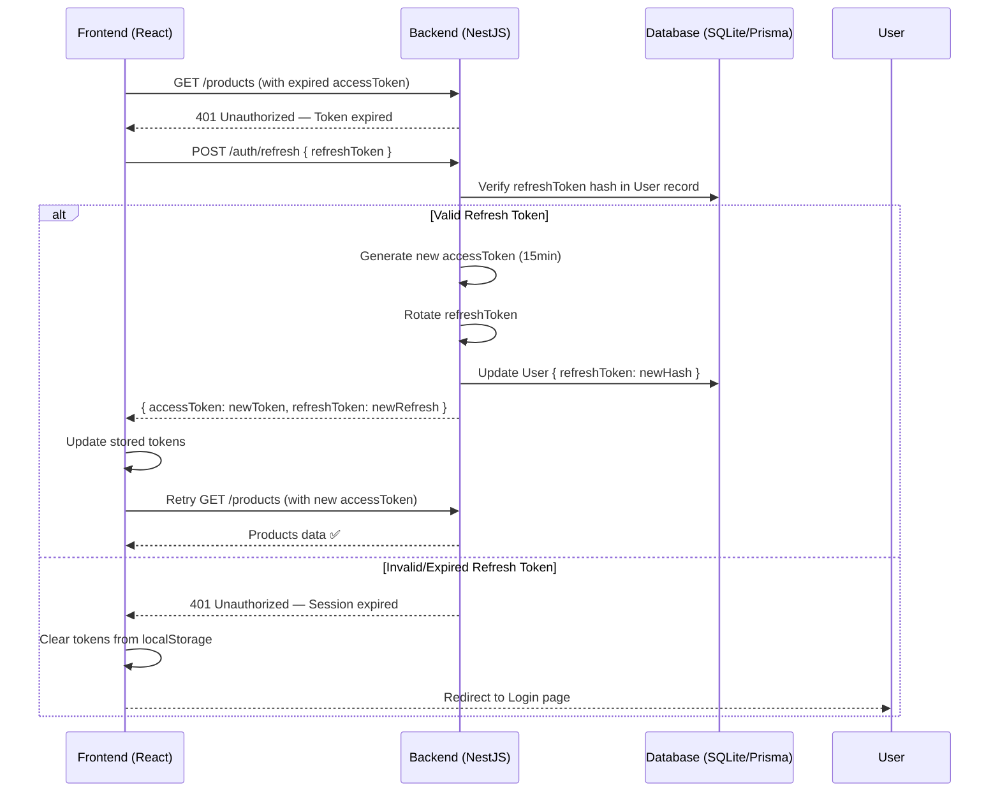
