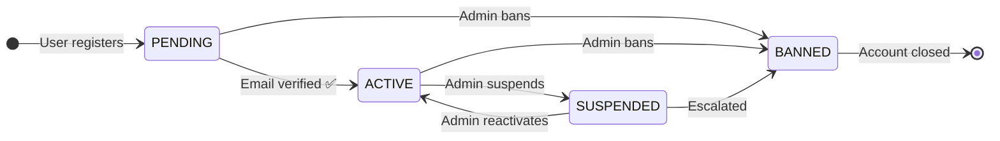
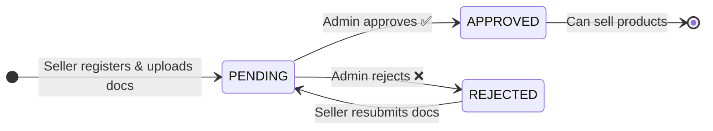
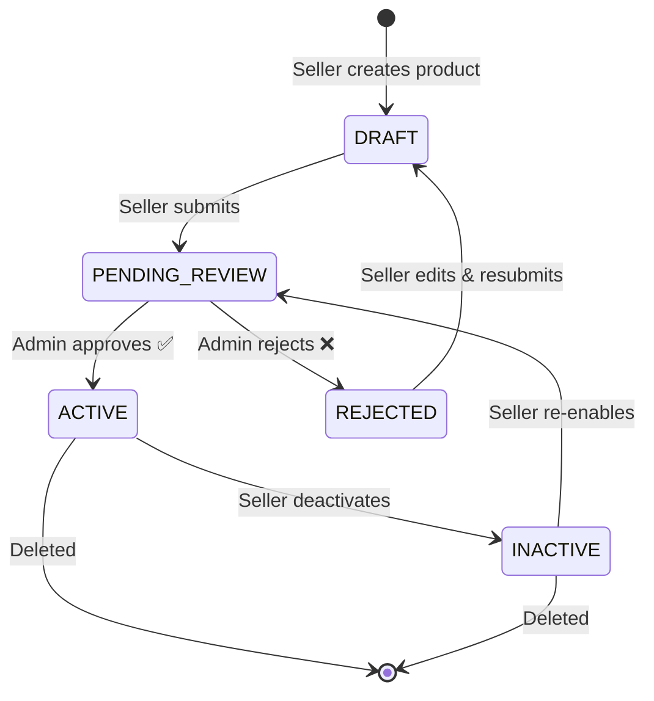
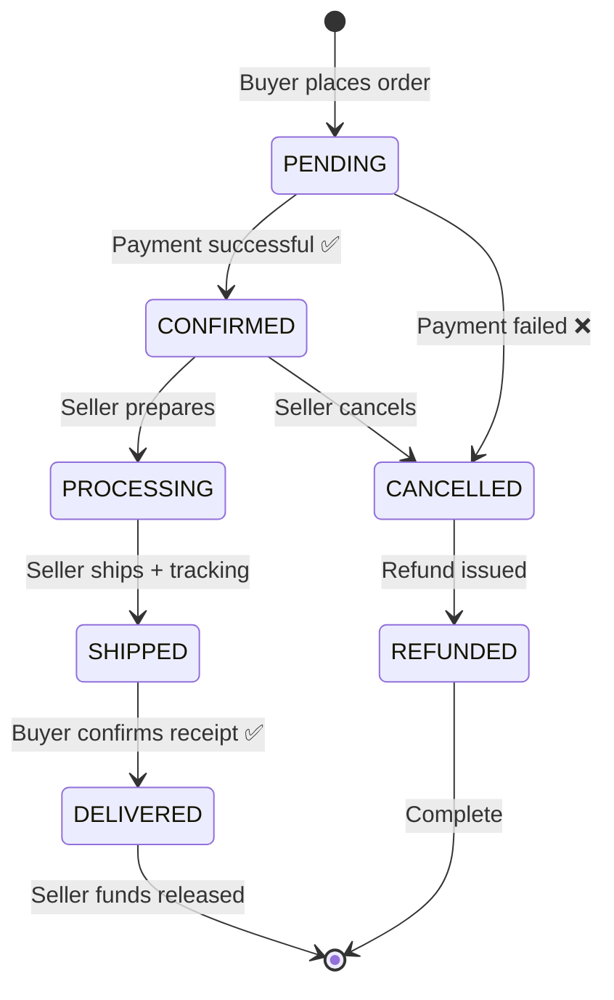
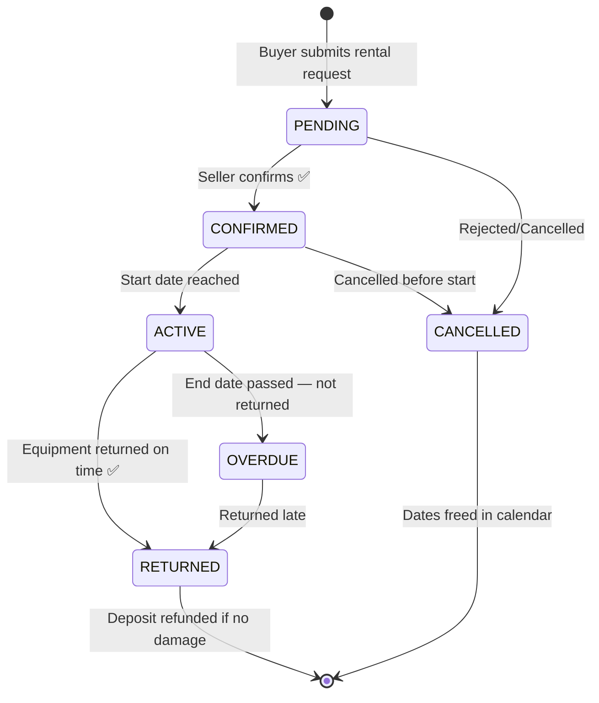
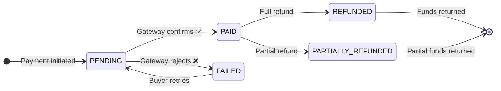
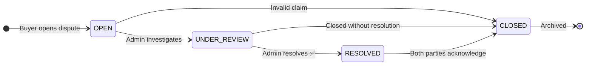
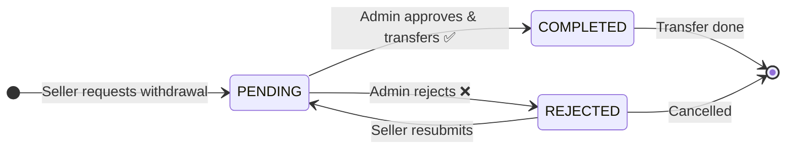
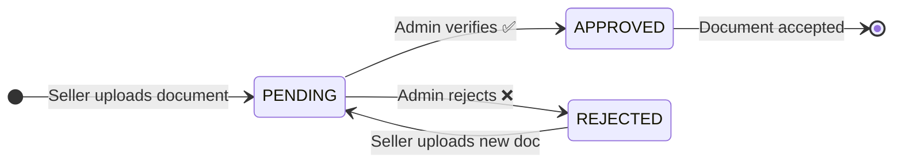

# 🔀 State Machine Diagrams — MediShop Pro

---

## State 1 — User Account Status

---

## State 2 — Seller Verification Status

---

## State 3 — Product Status

---

## State 4 — Order Status

---

## State 5 — Rental Status

---

## State 6 — Payment Status

---

## State 7 — Dispute Status

---

## State 8 — Withdrawal Request Status

---

## State 9 — Store Document Status

---

## 📊 States Summary Table

| Entity | States | Count |
|--------|--------|-------|
| **User Account** | PENDING → ACTIVE → SUSPENDED → BANNED | 4 |
| **Seller Verification** | PENDING → APPROVED / REJECTED | 3 |
| **Product** | DRAFT → PENDING_REVIEW → ACTIVE / INACTIVE / REJECTED | 5 |
| **Order** | PENDING → CONFIRMED → PROCESSING → SHIPPED → DELIVERED / CANCELLED / REFUNDED | 7 |
| **Rental** | PENDING → CONFIRMED → ACTIVE → RETURNED / OVERDUE / CANCELLED | 6 |
| **Payment** | PENDING → PAID / FAILED → REFUNDED / PARTIALLY_REFUNDED | 5 |
| **Dispute** | OPEN → UNDER_REVIEW → RESOLVED → CLOSED | 4 |
| **Withdrawal** | PENDING → COMPLETED / REJECTED | 3 |
| **Store Document** | PENDING → APPROVED / REJECTED | 3 |
