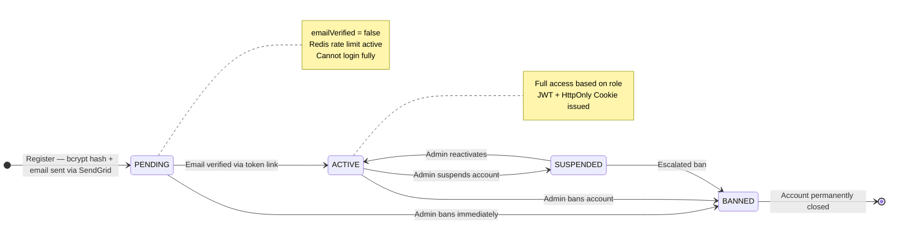
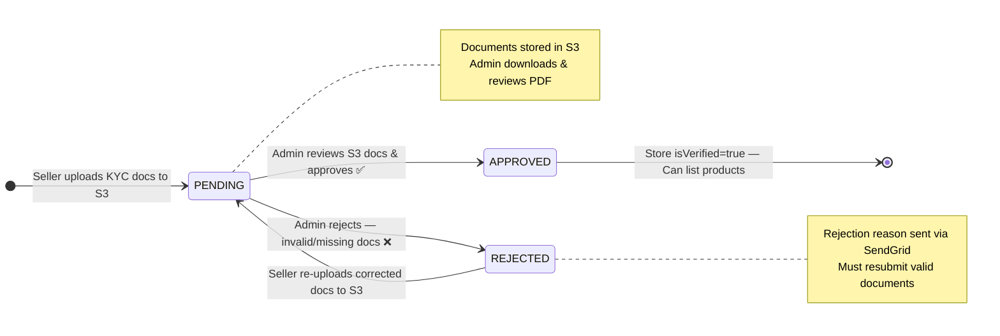
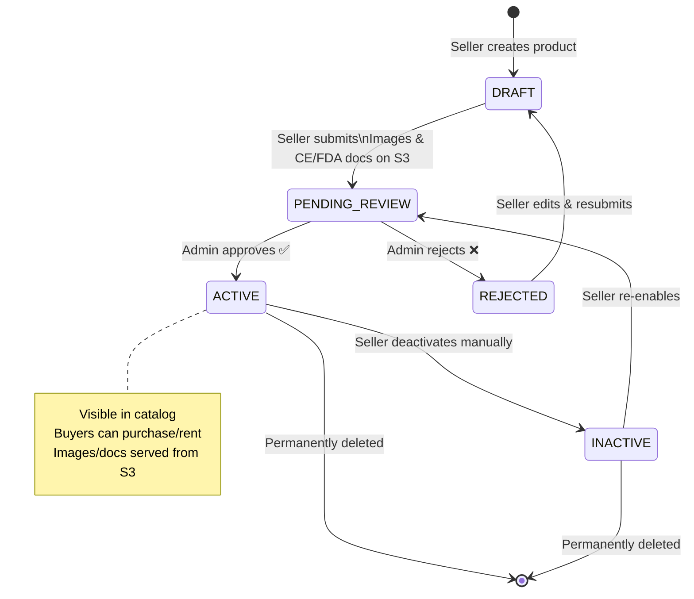
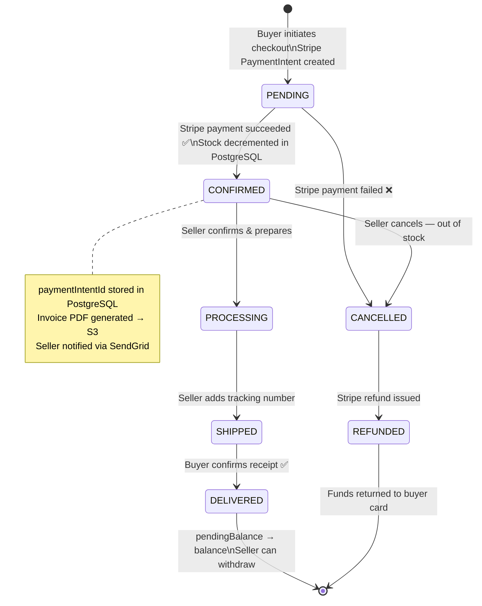
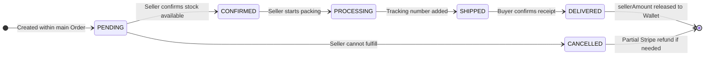
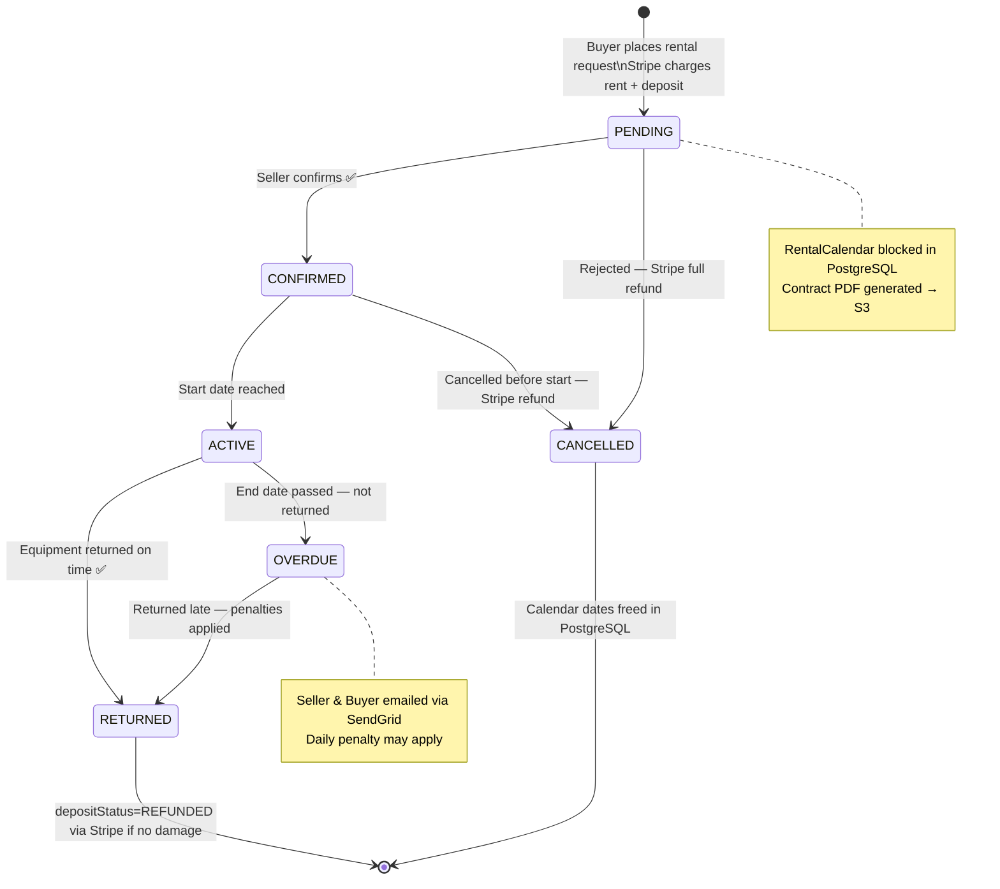
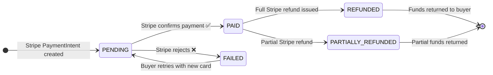
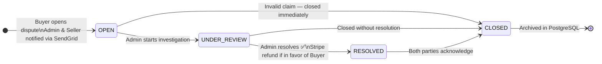
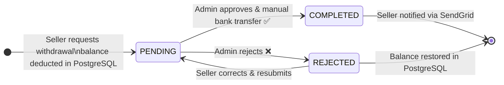
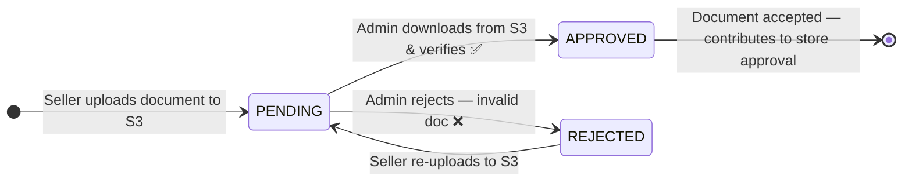

# 🔀 State Machine Diagrams — MediShop Pro
## (Updated: Stripe Deposit + KYC + Redis + PostgreSQL)

---

## State 1 — User Account Status

---

## State 2 — Seller KYC Verification Status

---

## State 3 — Product Status

---

## State 4 — Order Status (Stripe Payment)

---

## State 5 — SubOrder Status (Per Store)

---

## State 6 — Rental Status (Stripe Deposit)

---

## State 7 — Payment Status (Stripe)

---

## State 8 — Dispute Status

---

## State 9 — Withdrawal Status

---

## State 10 — Store Document (KYC) Status

---

## 📊 States Summary Table

| Entity | States | Key Integration |
|--------|--------|----------------|
| **User Account** | PENDING → ACTIVE → SUSPENDED → BANNED | SendGrid verification email |
| **Seller KYC** | PENDING → APPROVED / REJECTED | S3 documents, SendGrid notification |
| **Product** | DRAFT → PENDING_REVIEW → ACTIVE / INACTIVE / REJECTED | S3 images & CE/FDA docs |
| **Order** | PENDING → CONFIRMED → PROCESSING → SHIPPED → DELIVERED | Stripe PaymentIntent, S3 Invoice |
| **SubOrder** | PENDING → CONFIRMED → PROCESSING → SHIPPED → DELIVERED | PostgreSQL per-store tracking |
| **Rental** | PENDING → CONFIRMED → ACTIVE → RETURNED / OVERDUE | Stripe Deposit, S3 Contract PDF |
| **Payment** | PENDING → PAID / FAILED → REFUNDED | Stripe API |
| **Dispute** | OPEN → UNDER_REVIEW → RESOLVED → CLOSED | Stripe Refund, SendGrid |
| **Withdrawal** | PENDING → COMPLETED / REJECTED | Manual bank transfer, SendGrid |
| **Store Document** | PENDING → APPROVED / REJECTED | S3 storage, Admin review |
