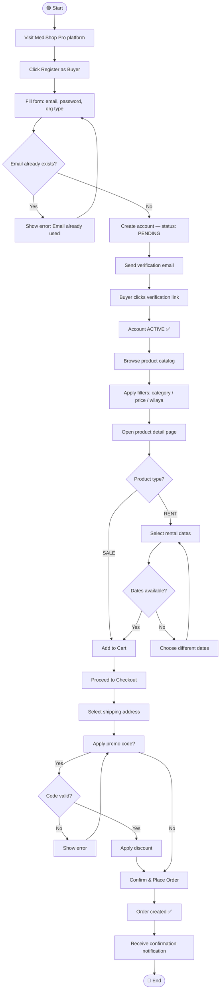
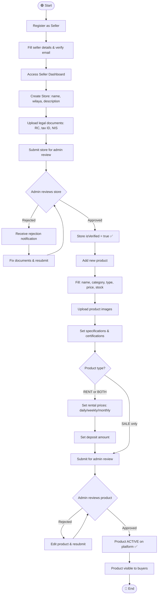
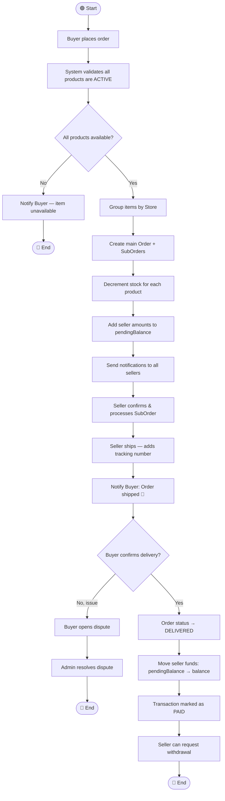
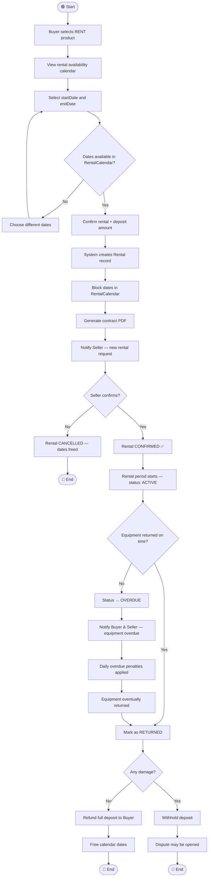
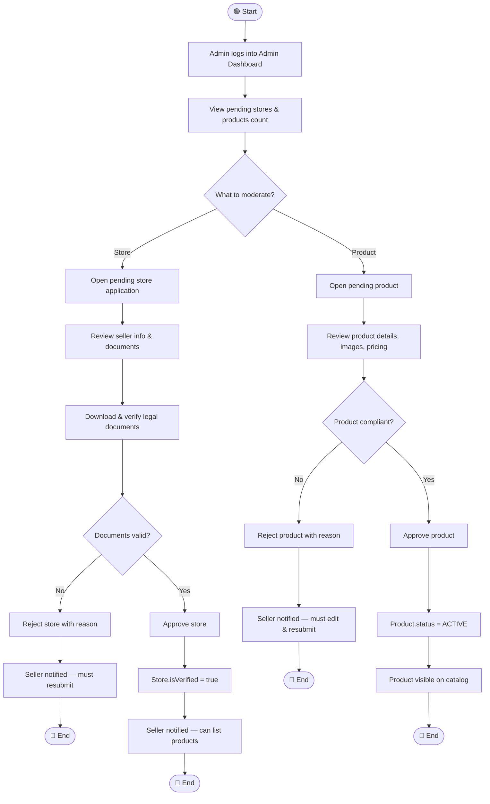
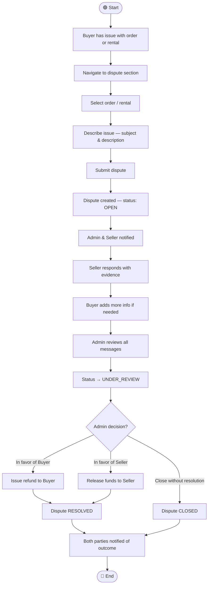
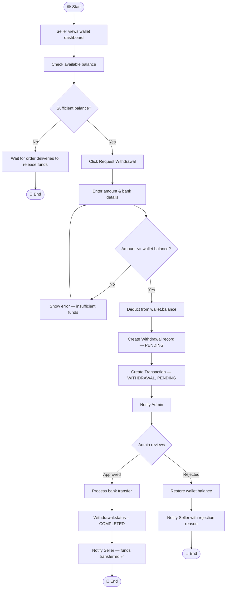
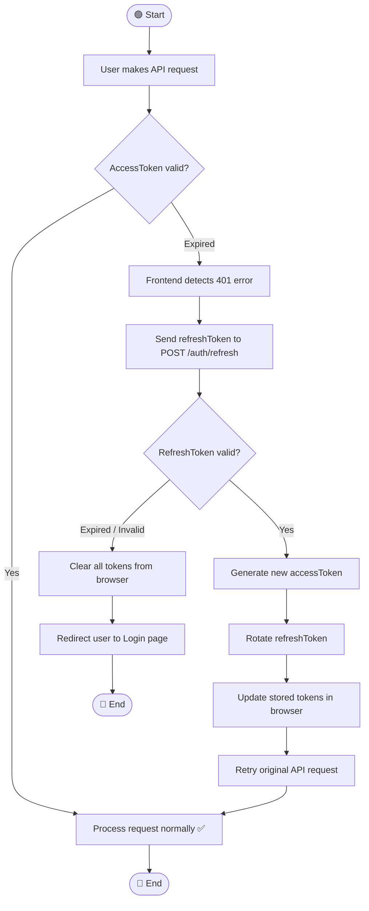

# 🏃 Activity Diagrams — MediShop Pro
## End-to-End Workflow Flows

---

## Activity 1 — Buyer Registration & First Purchase

---

## Activity 2 — Seller Onboarding & Product Listing

---

## Activity 3 — Order Processing Workflow

---

## Activity 4 — Equipment Rental Lifecycle

---

## Activity 5 — Admin Store & Product Moderation

---

## Activity 6 — Dispute Opening & Resolution

---

## Activity 7 — Seller Withdrawal Flow

---

## Activity 8 — JWT Token Refresh & Session Management

