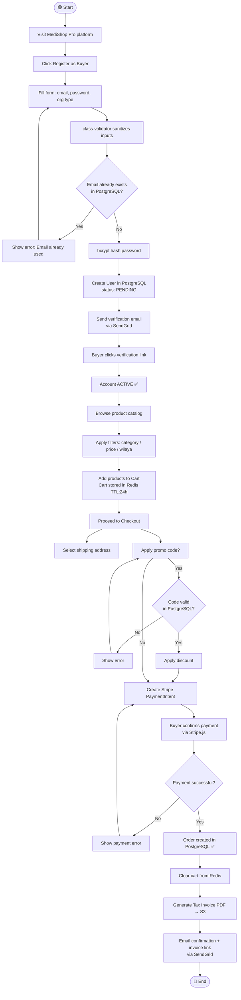
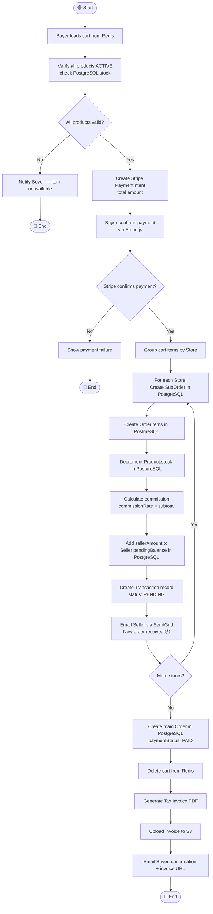
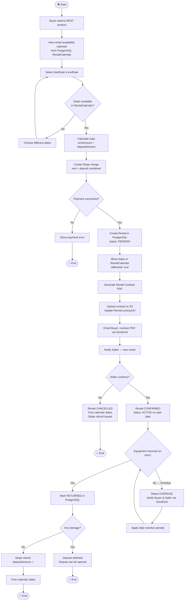
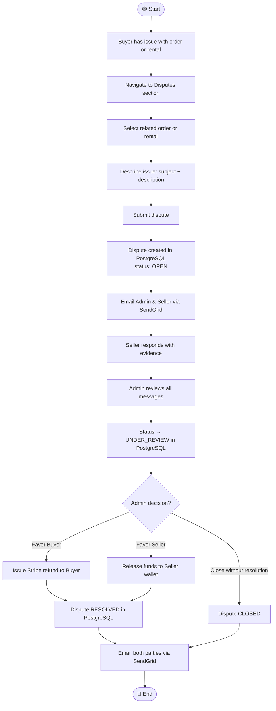
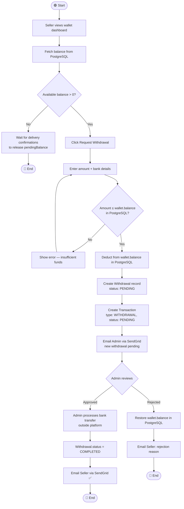
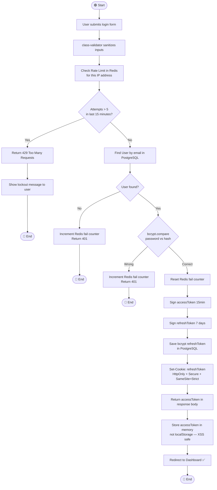

# 🏃 Activity Diagrams — MediShop Pro
## End-to-End Workflows (PostgreSQL + Redis + Stripe + S3 + KYC)

---

## Activity 1 — Buyer Registration & First Purchase



---

## Activity 2 — Seller KYC Onboarding & Product Listing

```mermaid
flowchart TD
  Start([🟢 Start]) --> B1[Register as Seller]
  B1 --> B2[Fill form → bcrypt hash password]
  B2 --> B3[Verify email via SendGrid]
  B3 --> B4[Access Seller Dashboard]
  B4 --> B5[Create Store: name, wilaya, taxId]
  B5 --> B6[Upload KYC documents\nRC, tax, health license]
  B6 --> B7[Files uploaded to AWS S3 / Cloudinary]
  B7 --> B8[StoreDocuments saved in PostgreSQL\nstatus: PENDING]
  B8 --> B9[Submit store for Admin review]
  B9 --> B10{Admin KYC Review}
  B10 -- Rejected --> B11[Email Seller — rejection reason\nvia SendGrid]
  B11 --> B12[Fix documents & re-upload to S3]
  B12 --> B10
  B10 -- Approved --> B13[Store isVerified = true\nPostgreSQL updated ✅]
  B13 --> B14[Email Seller — "Store approved" via SendGrid]
  B14 --> B15[Add new product]
  B15 --> B16[Fill product details + pricing]
  B16 --> B17[Upload images → AWS S3]
  B17 --> B18[Upload certifications PDF → S3\nCE / FDA documents]
  B18 --> B19{Product type?}
  B19 -- RENT or BOTH --> B20[Set rental prices\ndaily/weekly/monthly + deposit]
  B20 --> B21[Submit for Admin review\nstatus: PENDING_REVIEW]
  B19 -- SALE only --> B21
  B21 --> B22{Admin reviews product}
  B22 -- Rejected --> B23[Edit product & resubmit]
  B23 --> B22
  B22 -- Approved --> B24[Product ACTIVE on platform ✅]
  B24 --> End([🔴 End])
```

---

## Activity 3 — Multi-Vendor Order Processing (Stripe + Redis + Split Payment)



---

## Activity 4 — Equipment Rental with Stripe Deposit



---

## Activity 5 — Admin KYC Moderation

```mermaid
flowchart TD
  Start([🟢 Start]) --> E1[Admin logs into Admin Dashboard\nRole Guard: SUPER_ADMIN only]
  E1 --> E2[View pending count:\nstores + products awaiting review]
  E2 --> E3{What to moderate?}

  E3 -- Store KYC --> E4[Open pending store application]
  E4 --> E5[Review seller info in PostgreSQL]
  E5 --> E6[Download KYC documents from S3\nRC, tax, health license]
  E6 --> E7{Documents valid\nand complete?}
  E7 -- No --> E8[Reject store with written reason]
  E8 --> E9[Email Seller via SendGrid\n rejection reason]
  E9 --> End1([🔴 End])
  E7 -- Yes --> E10[Approve store in PostgreSQL\nisVerified: true\nverificationStatus: APPROVED]
  E10 --> E11[Email Seller — "Store approved ✅"]
  E11 --> End2([🔴 End])

  E3 -- Product --> E12[Open pending product\nstatus: PENDING_REVIEW]
  E12 --> E13[Review details, images from S3]
  E13 --> E14[Check certifications PDF\nCE / FDA from S3]
  E14 --> E15{Product compliant\nand safe?}
  E15 -- No --> E16[Reject product\nstatus: REJECTED]
  E16 --> E17[Email Seller via SendGrid]
  E17 --> End3([🔴 End])
  E15 -- Yes --> E18[Approve product\nstatus: ACTIVE in PostgreSQL]
  E18 --> E19[Product visible on catalog ✅]
  E19 --> End4([🔴 End])
```

---

## Activity 6 — Dispute & Refund via Stripe



---

## Activity 7 — Seller Withdrawal Flow



---

## Activity 8 — Secure Login with Rate Limiting


