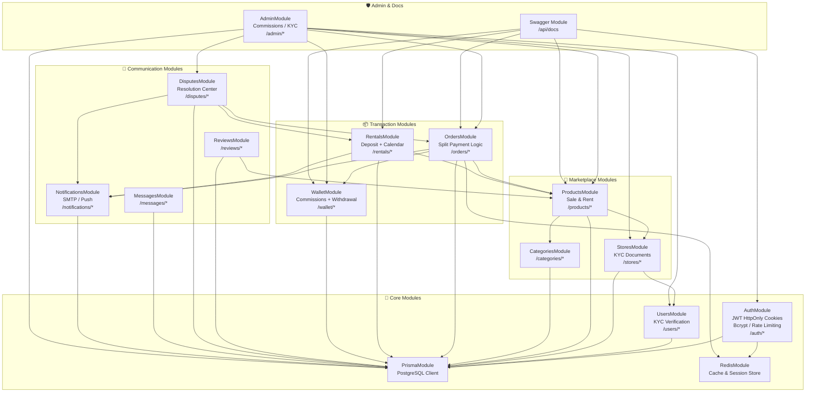
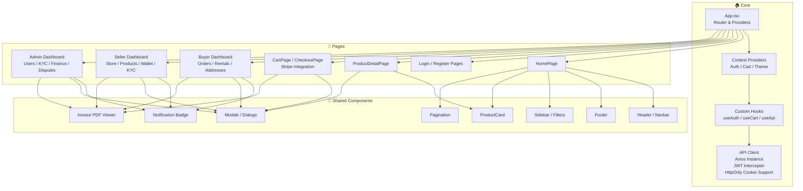
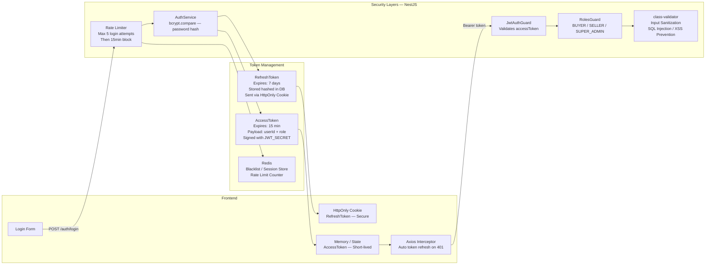
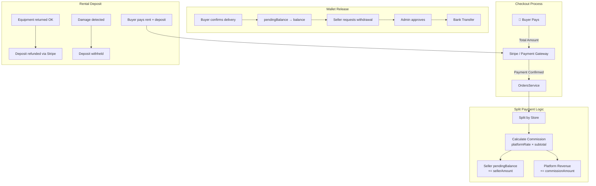

# 🧩 Component Diagram — MediShop Pro
## Software Architecture & Module Dependencies

---

## Component 1 — Full System Architecture

```mermaid
graph TB
  subgraph "🌐 CLIENT LAYER — Browser"
    subgraph "⚛️ React 19 + Vite Frontend"
      UI_AUTH[AuthModule\nLogin / Register / Logout]
      UI_HOME[StorefrontModule\nHomepage / Catalog / Search]
      UI_PRODUCT[ProductModule\nProduct Detail / Reviews]
      UI_CART[CartModule\nCart / Checkout / PromoCode]
      UI_BUYER[BuyerDashboard\nOrders / Rentals / Wishlist]
      UI_SELLER[SellerDashboard\nStore / Products / Wallet]
      UI_ADMIN[AdminDashboard\nUsers / Stores / Finance / KYC]
      UI_MSG[MessagingModule\nChat / Notifications]
    end
  end

  subgraph "⚙️ API LAYER — NestJS Backend"
    API_AUTH[AuthModule\nJWT HttpOnly Cookies / Bcrypt\nRate Limiting / Guards]
    API_USERS[UsersModule\nProfiles / KYC / Addresses]
    API_STORES[StoresModule\nCRUD / Documents / Approval]
    API_PRODUCTS[ProductsModule\nCRUD / Images / Search / Swagger]
    API_ORDERS[OrdersModule\nCart / Checkout / SubOrders\nSplit Payments]
    API_RENTALS[RentalsModule\nCalendar / Deposit / Contract PDF]
    API_WALLET[WalletModule\nTransactions / Withdrawal / Commission]
    API_REVIEWS[ReviewsModule\nRatings / Replies]
    API_DISPUTES[DisputesModule\nMessages / Resolution / KYC]
    API_MSG[MessagesModule\nConversations / Messages]
    API_NOTIF[NotificationsModule\nAlerts / Email]
    API_ADMIN[AdminModule\nStats / Moderation / Commissions]
    API_CATEGORIES[CategoriesModule\nHierarchy / CRUD]
    SWAGGER[Swagger / OpenAPI\nAPI Documentation & Testing]
  end

  subgraph "🗄️ DATA LAYER"
    PRISMA[(Prisma ORM)]
    DB[(PostgreSQL Database\n28+ Tables)]
    REDIS[(Redis Cache\nCart / Sessions / Rate Limit)]
    S3[(AWS S3 / Cloudinary\nProduct Images\nMedical Documents\nInvoice PDFs)]
  end

  subgraph "💳 EXTERNAL SERVICES"
    PAYMENT[Stripe / Payment Gateway\nSplit Payments\nDeposit Management]
    MAIL[SMTP / SendGrid\nEmail Notifications]
  end

  UI_AUTH --> API_AUTH
  UI_HOME & UI_PRODUCT & UI_CART --> API_AUTH
  UI_BUYER --> API_ORDERS & API_RENTALS & API_WALLET & API_REVIEWS & API_DISPUTES
  UI_SELLER --> API_STORES & API_PRODUCTS & API_ORDERS & API_WALLET
  UI_ADMIN --> API_ADMIN & API_USERS & API_STORES & API_PRODUCTS
  UI_MSG --> API_MSG & API_NOTIF

  API_AUTH --> PRISMA
  API_ORDERS --> REDIS
  API_AUTH --> REDIS
  API_USERS & API_STORES & API_PRODUCTS --> PRISMA
  API_ORDERS & API_RENTALS & API_WALLET & API_REVIEWS --> PRISMA
  API_DISPUTES & API_MSG & API_NOTIF & API_ADMIN --> PRISMA
  API_CATEGORIES --> PRISMA
  PRISMA --> DB
  API_PRODUCTS & API_STORES --> S3
  API_ORDERS & API_WALLET --> PAYMENT
  API_NOTIF --> MAIL
  SWAGGER --> API_AUTH & API_PRODUCTS & API_ORDERS
```

---

## Component 2 — Backend NestJS Module Dependencies

---

## Component 3 — Frontend React Module Structure

---

## Component 4 — Authentication & Security Architecture

---

## Component 5 — Payment & Commission Flow

---

## 📋 Technology Stack (Per readme2 & README3)

| Layer | Technology | Version | Purpose |
|-------|-----------|---------|---------|
| **Frontend** | React | 19 | UI Framework |
| **Frontend** | Vite | Latest | Build Tool — Fast HMR |
| **Frontend** | TypeScript | 5.x | Type Safety |
| **Frontend** | React Router | 7.x | Client-side Routing |
| **Frontend** | Context API | Built-in | State Management |
| **Frontend** | Axios | Latest | HTTP Client + JWT Interceptor |
| **Backend** | NestJS | 10.x | Modular API Framework |
| **Backend** | TypeScript | 5.x | Type Safety |
| **Backend** | Prisma ORM | 7.x | Database Access Layer |
| **Backend** | JWT + HttpOnly | Latest | Secure Authentication |
| **Backend** | bcrypt | Latest | Password Hashing |
| **Backend** | class-validator | Latest | Input Validation / XSS Prevention |
| **Backend** | Swagger/OpenAPI | Latest | API Documentation |
| **Database** | PostgreSQL | 15+ | Primary Relational Database |
| **Cache** | Redis | 7.x | Cart / Sessions / Rate Limiting |
| **Storage** | AWS S3 / Cloudinary | Latest | Images, Documents, PDFs |
| **Payment** | Stripe | Latest | Split Payments & Deposits |
| **Email** | SMTP / SendGrid | Latest | Notifications & Verification |
| **DevOps** | Docker + Compose | Latest | Containerization |
| **DevOps** | AWS / DigitalOcean | Latest | Cloud Hosting |
