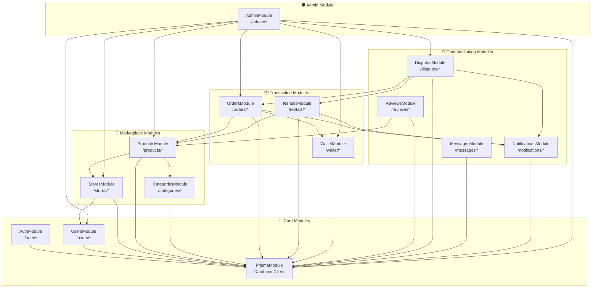
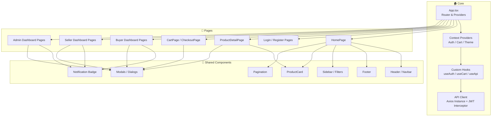
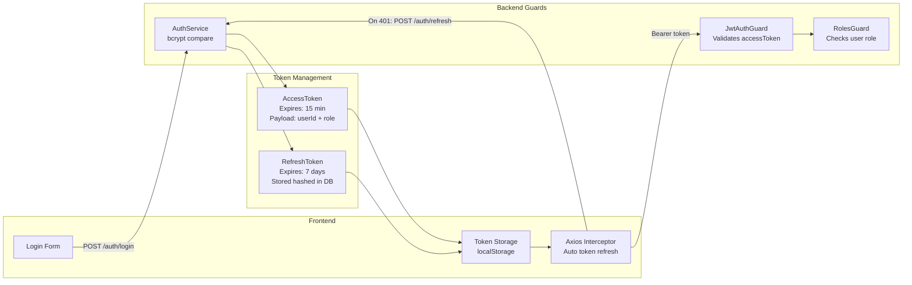

# 🧩 Component Diagram — MediShop Pro
## Software Architecture & Module Dependencies

---

## Component 1 — Full System Architecture

```mermaid
graph TB
  subgraph "🌐 CLIENT LAYER — Browser"
    subgraph "⚛️ React 19 Frontend"
      UI_AUTH[AuthModule\nLogin / Register / Logout]
      UI_HOME[StorefrontModule\nHomepage / Catalog / Search]
      UI_PRODUCT[ProductModule\nProduct Detail / Reviews]
      UI_CART[CartModule\nCart / Checkout / PromoCode]
      UI_BUYER[BuyerDashboard\nOrders / Rentals / Wishlist]
      UI_SELLER[SellerDashboard\nStore / Products / Wallet]
      UI_ADMIN[AdminDashboard\nUsers / Stores / Finance]
      UI_MSG[MessagingModule\nChat / Notifications]
    end
  end

  subgraph "⚙️ API LAYER — NestJS Backend"
    API_AUTH[AuthModule\nJWT / Bcrypt / Guards]
    API_USERS[UsersModule\nProfiles / Addresses]
    API_STORES[StoresModule\nCRUD / Documents / Approval]
    API_PRODUCTS[ProductsModule\nCRUD / Images / Search]
    API_ORDERS[OrdersModule\nCart / Checkout / SubOrders]
    API_RENTALS[RentalsModule\nCalendar / Contract]
    API_WALLET[WalletModule\nTransactions / Withdrawal]
    API_REVIEWS[ReviewsModule\nRatings / Replies]
    API_DISPUTES[DisputesModule\nMessages / Resolution]
    API_MSG[MessagesModule\nConversations / Messages]
    API_NOTIF[NotificationsModule\nAlerts / Email]
    API_ADMIN[AdminModule\nStats / Moderation]
    API_CATEGORIES[CategoriesModule\nHierarchy / CRUD]
  end

  subgraph "🗄️ DATA LAYER"
    PRISMA[(Prisma ORM)]
    DB[(SQLite Database\n28 Tables)]
    FILES[File Storage\nImages / Documents / PDFs]
  end

  UI_AUTH & UI_HOME & UI_PRODUCT & UI_CART --> API_AUTH
  UI_BUYER --> API_ORDERS & API_RENTALS & API_WALLET & API_REVIEWS & API_DISPUTES
  UI_SELLER --> API_STORES & API_PRODUCTS & API_ORDERS & API_WALLET
  UI_ADMIN --> API_ADMIN & API_USERS & API_STORES & API_PRODUCTS
  UI_MSG --> API_MSG & API_NOTIF

  API_AUTH & API_USERS & API_STORES & API_PRODUCTS --> PRISMA
  API_ORDERS & API_RENTALS & API_WALLET & API_REVIEWS --> PRISMA
  API_DISPUTES & API_MSG & API_NOTIF & API_ADMIN --> PRISMA
  API_CATEGORIES --> PRISMA

  PRISMA --> DB
  API_PRODUCTS & API_STORES --> FILES
```



---

## Component 2 — Backend NestJS Module Dependencies



---

## Component 3 — Frontend React Module Structure



---

## Component 4 — Authentication & Security Flow



---

## Component 5 — Data Flow: Product Search & Filter

```mermaid
graph LR
  USER[👤 User] -->|Types search query| SEARCH_BAR[SearchBar Component]
  SEARCH_BAR -->|Debounced query| FILTER_CTX[Filter Context]
  FILTER_CTX -->|GET /products?name=&category=&wilaya=&minPrice=| API_CLIENT[Axios Client]
  API_CLIENT -->|HTTP Request| PRODUCTS_CTRL[ProductsController\n/products]
  PRODUCTS_CTRL --> PRODUCTS_SVC[ProductsService]
  PRODUCTS_SVC -->|Prisma where clause| DB[(Database)]
  DB -->|Paginated results| PRODUCTS_SVC
  PRODUCTS_SVC -->|ProductDTO[]| PRODUCTS_CTRL
  PRODUCTS_CTRL -->|JSON Response| API_CLIENT
  API_CLIENT --> PRODUCT_GRID[ProductGrid Component]
  PRODUCT_GRID --> PRODUCT_CARD[ProductCard × N]
  PRODUCT_CARD --> USER
```

---

## 📋 Technology Stack Summary

| Layer | Technology | Version | Purpose |
|-------|-----------|---------|---------|
| **Frontend** | React | 19 | UI Framework |
| **Frontend** | TypeScript | 5.x | Type Safety |
| **Frontend** | React Router | 6.x | Client-side Routing |
| **Frontend** | Axios | Latest | HTTP Client |
| **Backend** | NestJS | 10.x | API Framework |
| **Backend** | TypeScript | 5.x | Type Safety |
| **Backend** | Prisma ORM | 5.x | Database Access |
| **Backend** | JWT | Latest | Authentication |
| **Backend** | bcrypt | Latest | Password Hashing |
| **Database** | SQLite | 3.x | Local Database |
| **DevOps** | Docker | Latest | Containerization |
| **DevOps** | Docker Compose | Latest | Multi-service orchestration |
