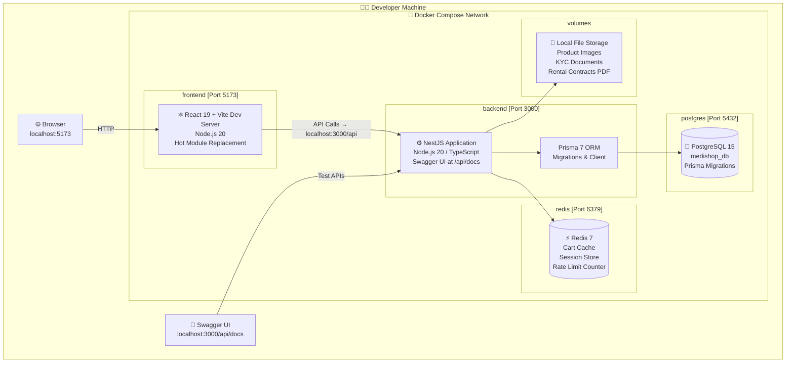
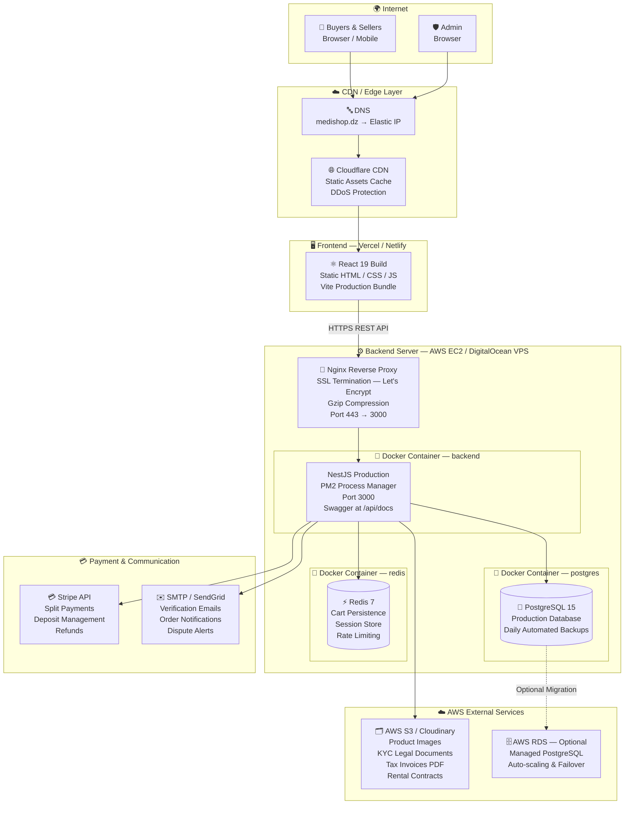
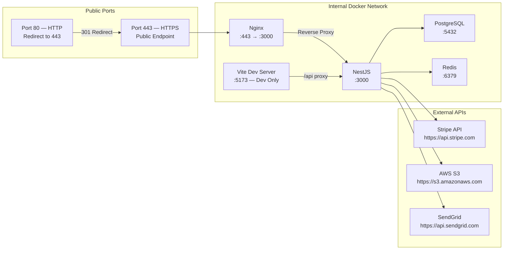
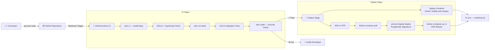
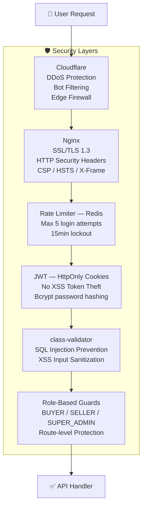
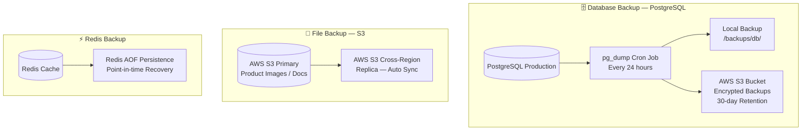

# 🚀 Deployment Diagram — MediShop Pro
## Infrastructure & Hosting Architecture (PostgreSQL + Redis + S3 + Stripe)

---

## Deployment 1 — Docker Compose (Local Development)

---

## Deployment 2 — Production Architecture (Cloud — AWS / DigitalOcean)

---

## Deployment 3 — Network Ports & Services Map

---

## Deployment 4 — CI/CD Pipeline

---

## Deployment 5 — Security Architecture

---

## Deployment 6 — Backup & Recovery Strategy

---

## 📋 Infrastructure Summary (Per readme2 & README3)

| Component | Technology | Hosting | Notes |
|-----------|-----------|---------|-------|
| **Frontend** | React 19 + Vite | Vercel / Netlify | CDN-cached static build |
| **Backend** | NestJS + Node 20 | AWS EC2 / DigitalOcean | PM2 + Docker |
| **Database** | PostgreSQL 15 | Docker / AWS RDS | Auto daily backups |
| **Cache** | Redis 7 | Docker Container | Cart, Sessions, Rate Limit |
| **File Storage** | AWS S3 / Cloudinary | AWS | Images, KYC Docs, PDFs |
| **Payment** | Stripe | External API | Split payments + Deposits |
| **Reverse Proxy** | Nginx | VPS | SSL + Compression |
| **SSL** | Let's Encrypt | Nginx / Cloudflare | Auto-renewed |
| **CDN / Security** | Cloudflare | Edge | DDoS + Bot protection |
| **Email** | SMTP / SendGrid | External API | Transactional emails |
| **CI/CD** | GitHub Actions | GitHub | Auto-deploy on push |
| **API Docs** | Swagger / OpenAPI | /api/docs | Dev & testing |
| **Monitoring** | PM2 Dashboard | VPS | Process health & logs |
