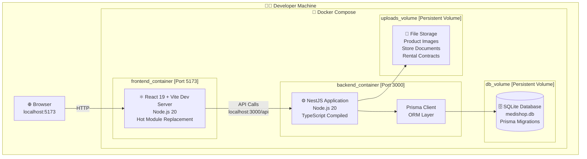
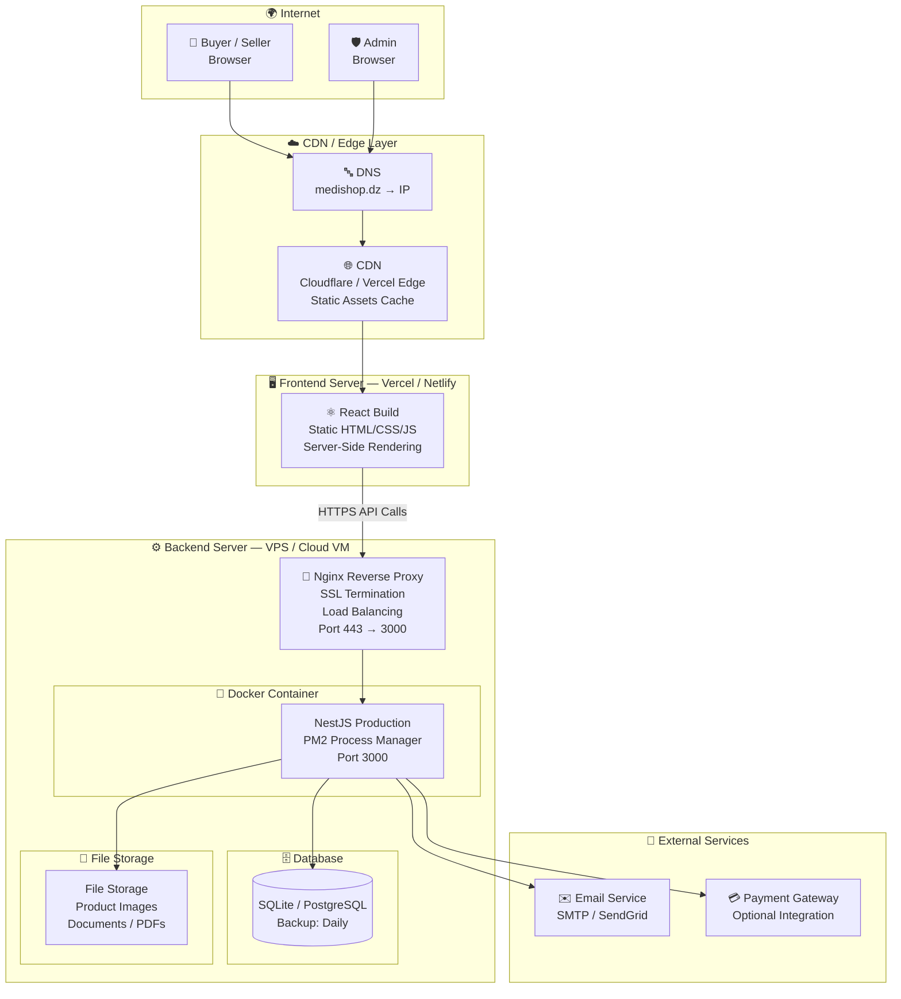
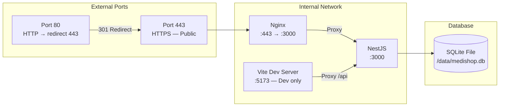
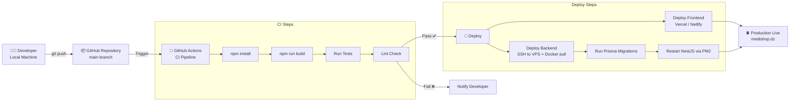
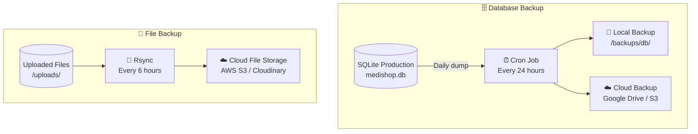

# 🚀 Deployment Diagram — MediShop Pro
## Infrastructure & Hosting Architecture

---

## Deployment 1 — Docker Compose (Local Development)

---

## Deployment 2 — Production Architecture (Cloud)

---

## Deployment 3 — Network & Port Configuration

---

## Deployment 4 — CI/CD Pipeline

---

## Deployment 5 — Data Backup Strategy

---

## 📋 Infrastructure Summary

| Component | Technology | Environment | Notes |
|-----------|-----------|-------------|-------|
| **Frontend** | React 19 + Vite | Vercel / Netlify | CDN-cached static build |
| **Backend** | NestJS + Node 20 | VPS (Docker) | PM2 for process management |
| **Database** | SQLite / PostgreSQL | Same VPS | Daily backups to cloud |
| **Reverse Proxy** | Nginx | Same VPS | SSL termination + compression |
| **SSL** | Let's Encrypt | Nginx | Auto-renewed via Certbot |
| **File Storage** | Local FS / S3 | VPS / Cloud | Images, Docs, PDFs |
| **Email** | SMTP / SendGrid | External API | Verification & notifications |
| **CI/CD** | GitHub Actions | GitHub | Auto-deploy on push to main |
| **Monitoring** | PM2 Dashboard | VPS | Process health & logs |
| **Containerization** | Docker + Compose | All envs | Consistent dev/prod setup |
