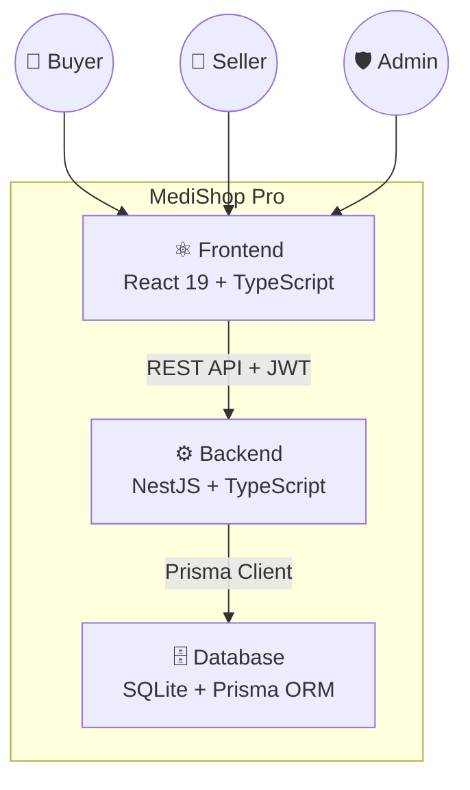

# 📊 UML Diagrams — MediShop Pro
## Complete System Documentation

> Medical Equipment B2B Marketplace — Algeria
> **Tech Stack:** React 19 + NestJS + Prisma + SQLite

---

## 📁 Diagram Files

| # | File | Diagram Type | Description |
|---|------|-------------|-------------|
| 1 | [01_use_case_diagram.md](./01_use_case_diagram.md) | **Use Case Diagram** | All actions for Buyer, Seller & Admin (100 use cases) |
| 2 | [02_sequence_diagram.md](./02_sequence_diagram.md) | **Sequence Diagram** | 11 interaction flows: login, checkout, rental, dispute... |
| 3 | [03_state_machine_diagram.md](./03_state_machine_diagram.md) | **State Machine Diagram** | 9 state machines: Order, Product, Rental, Payment... |
| 4 | [04_activity_diagram.md](./04_activity_diagram.md) | **Activity Diagram** | 8 end-to-end workflows: registration, purchase, withdrawal... |
| 5 | [05_component_diagram.md](./05_component_diagram.md) | **Component Diagram** | Frontend & Backend module architecture |
| 6 | [06_deployment_diagram.md](./06_deployment_diagram.md) | **Deployment Diagram** | Docker, CI/CD, cloud infrastructure |
| 7 | [07_class_diagram.md](./07_class_diagram.md) | **Class Diagram** | 28 data models + 11 enums (complete Prisma schema) |

---

## 🎯 System Overview

---

## 👥 Three User Roles

| Role | Key Capabilities |
|------|-----------------|
| 👤 **Buyer** | Browse, purchase, rent equipment, reviews, disputes |
| 🏪 **Seller** | Manage store, list products, handle orders, withdraw earnings |
| 🛡️ **Super Admin** | Approve stores/products, manage users, resolve disputes, platform settings |

---

## 📐 Data Model Summary

| Module | Models | Enums |
|--------|--------|-------|
| 🔵 Users & Auth | 7 models | 4 enums |
| 🟡 Stores & Catalog | 7 models | 3 enums |
| 🟠 Orders & Cart | 5 models | 2 enums |
| 🟢 Rentals | 3 models | 1 enum |
| 🔴 Finance & Wallet | 4 models | 1 enum |
| 🟣 Support & Messaging | 5 models | 1 enum |
| **Total** | **28 Models** | **11 Enums** |

---

## 🔑 Key Workflows

1. **Seller Onboarding** → Register → Create Store → Upload Docs → Admin Approval
2. **Product Listing** → Add Product → Admin Review → Published to Catalog
3. **Multi-Vendor Checkout** → Cart → Order → SubOrders per Store → Delivery Confirmation
4. **Equipment Rental** → Select Dates → Check Availability → Rent → Return → Deposit Refund
5. **Seller Withdrawal** → Request → Admin Approval → Bank Transfer
6. **Dispute Resolution** → Buyer Opens → Messages Exchanged → Admin Resolves

---

*All diagrams use [Mermaid](https://mermaid.js.org/) syntax — viewable directly on GitHub.*
