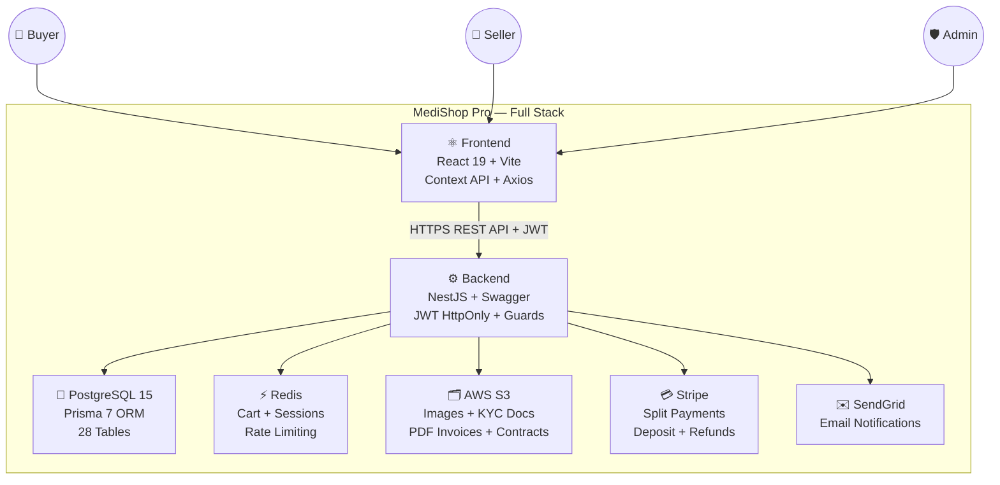

# 📊 UML Diagrams — MediShop Pro
## Complete System Documentation
### Medical Equipment B2B Marketplace — Algeria
> **Tech Stack:** React 19 + Vite · NestJS · PostgreSQL 15 · Prisma 7 · Redis · AWS S3 · Stripe · SendGrid · Swagger

---

## 📁 Diagram Files

| # | File | Type | Description |
|---|------|------|-------------|
| 1 | [01_use_case_diagram.md](./01_use_case_diagram.md) | **Use Case** | 107 use cases: Buyer / Seller / Admin — KYC, Stripe, S3 |
| 2 | [02_sequence_diagram.md](./02_sequence_diagram.md) | **Sequence** | 10 flows: Login HttpOnly Cookie, Stripe Checkout, Redis Cart... |
| 3 | [03_state_machine_diagram.md](./03_state_machine_diagram.md) | **State Machine** | 10 machines: Order, Rental, KYC, Dispute, Stripe Payment... |
| 4 | [04_activity_diagram.md](./04_activity_diagram.md) | **Activity** | 8 workflows: Registration, Checkout, KYC, Rental, Withdrawal... |
| 5 | [05_component_diagram.md](./05_component_diagram.md) | **Component** | Frontend + Backend modules + Redis + S3 + Stripe + Swagger |
| 6 | [06_deployment_diagram.md](./06_deployment_diagram.md) | **Deployment** | Docker, PostgreSQL, Redis, S3, Cloudflare, CI/CD, Backups |
| 7 | [07_class_diagram.md](./07_class_diagram.md) | **Class** | 28 PostgreSQL models + 11 enums — Complete Prisma 7 schema |

---

## 🎯 System Overview

---

## 👥 Three User Roles

| Role | Key Capabilities | Technologies Used |
|------|-----------------|------------------|
| 👤 **Buyer** | Browse, Stripe checkout, rent equipment, reviews, disputes | Redis Cart, Stripe.js, S3 Invoices |
| 🏪 **Seller** | KYC store setup, list products, handle orders, withdraw earnings | S3 Upload, SendGrid, Wallet |
| 🛡️ **Super Admin** | Approve KYC, moderate products, resolve disputes, manage commissions | Swagger, Stripe Refunds, S3 Review |

---

## 🔐 Security Architecture

| Layer | Technology | Purpose |
|-------|-----------|---------|
| **Authentication** | JWT + HttpOnly Cookies | Prevents XSS token theft |
| **Authorization** | NestJS Role Guards | BUYER / SELLER / SUPER_ADMIN routes |
| **Rate Limiting** | Redis Counter | Max 5 login attempts / 15min lockout |
| **Password** | bcrypt (rounds: 12) | Secure password hashing |
| **Validation** | class-validator | SQL Injection + XSS prevention |
| **Transport** | HTTPS / TLS 1.3 | All communications encrypted |
| **DDoS** | Cloudflare Edge | Bot filtering + traffic protection |

---

## 📐 Data Model Summary

| Module | Models | Key Features |
|--------|--------|-------------|
| 🔵 Users & Auth | 7 models | bcrypt, JWT, 2FA, KYC profiles |
| 🟡 Stores & Catalog | 7 models | KYC documents on S3, CE/FDA certs |
| 🟠 Orders & Cart | 5 models | Redis cart, Stripe split payments, S3 invoices |
| 🟢 Rentals | 3 models | Stripe deposit, S3 contracts, calendar |
| 🔴 Finance & Wallet | 4 models | Commission system, withdrawal, Stripe |
| 🟣 Support & Messaging | 5 models | Dispute resolution, S3 attachments |
| **Total** | **28 Models / 11 Enums** | **PostgreSQL 15 + Prisma 7** |

---

## 🔑 Key Business Workflows

1. **Seller KYC Onboarding** → Register → Upload docs to S3 → Admin review → Approved
2. **Product Moderation** → Add product + CE/FDA docs to S3 → Admin review → Published
3. **Multi-Vendor Checkout** → Redis Cart → Stripe PaymentIntent → Split by Store → S3 Invoice
4. **Equipment Rental** → Check Calendar → Stripe (rent+deposit) → S3 Contract PDF → Return
5. **Seller Withdrawal** → Request → Admin approves → Manual bank transfer → SendGrid notify
6. **Dispute Resolution** → Buyer opens → Evidence exchanged → Admin resolves → Stripe refund

---

*All diagrams use [Mermaid](https://mermaid.js.org/) syntax — rendered automatically on GitHub.*
*Compatible with readme2.md (Master Plan) and README3.md (v1.0 Report).*
