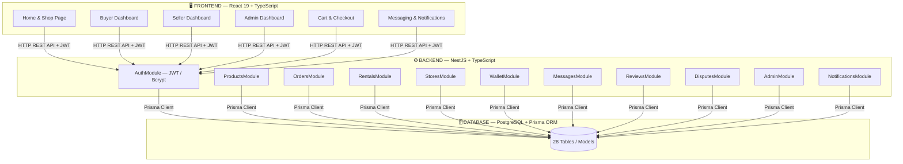
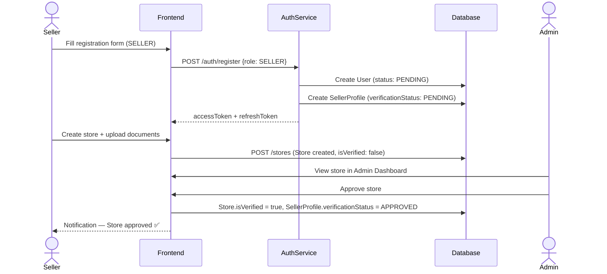
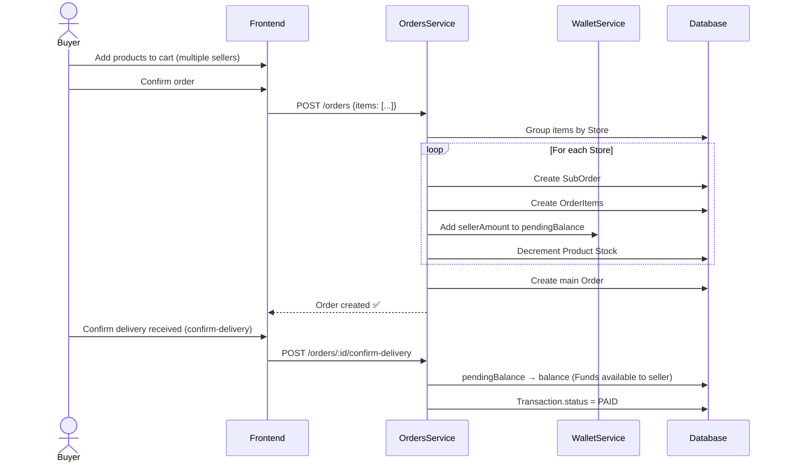
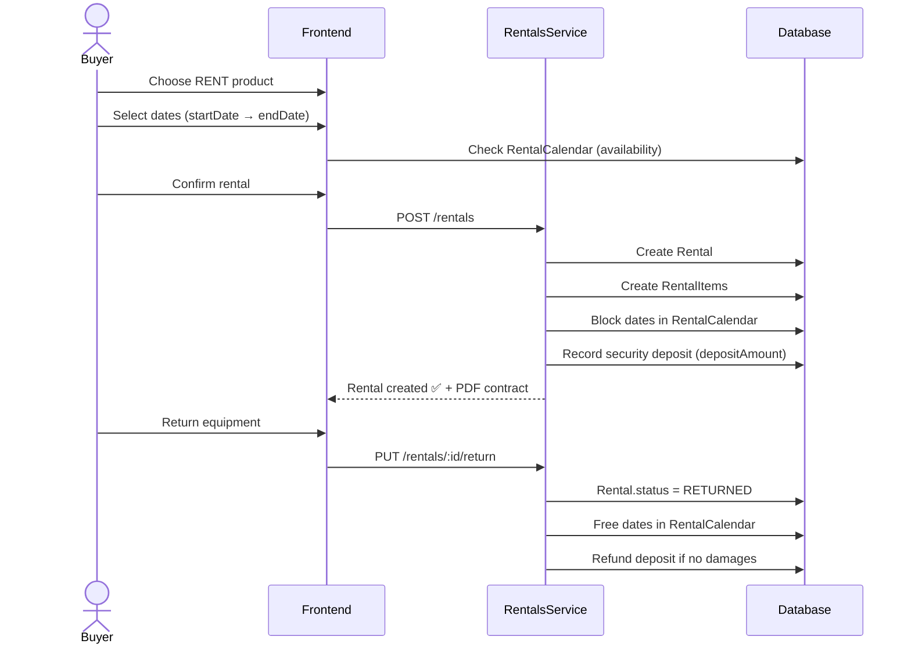
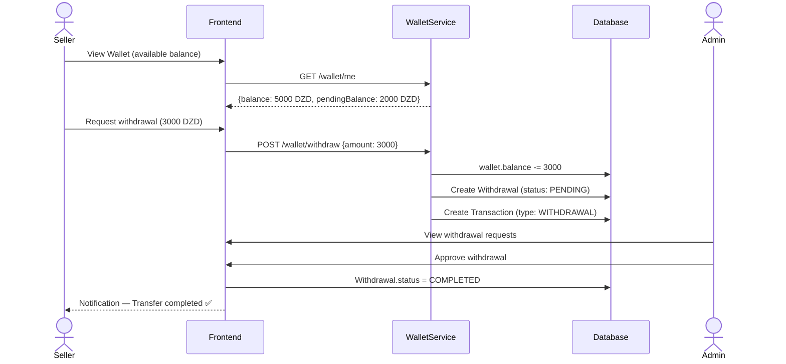
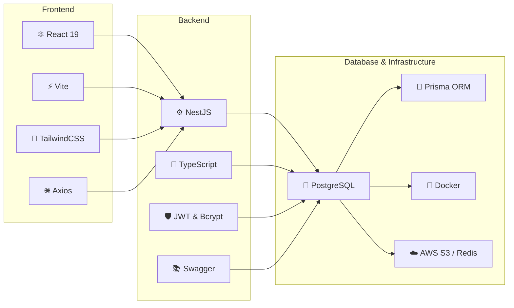

# 🏥 MediShop Pro — Complete Project Presentation
## B2B Medical Equipment Marketplace — Academic Presentation

---

> **MediShop Pro** is a **multi-vendor** e-commerce platform specialized in the purchase and **rental** of medical equipment in Algeria. It connects **buyers** (hospitals, clinics, doctors) with certified **sellers**, under the supervision of a platform **administrator**.

---

## 🏗️ 1. Global System Architecture (3-Tier)



---

## 👥 2. The 3 User Roles

```mermaid
graph LR
  subgraph "BUYER"
    B1[Register]
    B2[Browse products]
    B3[Buy / Rent]
    B4[Track orders]
    B5[Message seller]
    B6[Open a dispute]
    B7[Leave a review]
  end

  subgraph "SELLER"
    S1[Register + KYC verification]
    S2[Create store]
    S3[Add products]
    S4[Manage received orders]
    S5[Withdraw earnings — Wallet]
    S6[Reply to reviews]
  end

  subgraph "SUPER_ADMIN"
    A1[Approve stores (KYC)]
    A2[Approve products]
    A3[Manage all users]
    A4[View all transactions]
    A5[Resolve disputes]
    A6[Manage platform settings]
  end
```

---

## 🔄 3. Main Business Workflows

### Flow 1 — Seller Registration & Activation



---

### Flow 2 — Purchasing a Product (Multi-Vendor)



---

### Flow 3 — Equipment Rental



---

### Flow 4 — Earnings Withdrawal (Seller)



---

## 🌐 4. REST API — Main Endpoints

| Module | Method | Endpoint | Required Role |
|--------|---------|----------|-------------|
| **Auth** | POST | `/auth/register` | Public |
| | POST | `/auth/login` | Public |
| | GET | `/auth/me` | Authenticated |
| | POST | `/auth/logout` | Authenticated |
| **Products** | GET | `/products` | Public |
| | GET | `/products/:id` | Public |
| | POST | `/products` | SELLER |
| | PATCH | `/products/:id` | SELLER |
| | DELETE | `/products/:id` | SELLER |
| **Orders** | POST | `/orders` | BUYER |
| | GET | `/orders/my-orders` | BUYER |
| | GET | `/orders/store/:id` | SELLER |
| | POST | `/orders/:id/confirm-delivery` | BUYER |
| **Rentals** | POST | `/rentals` | BUYER |
| | GET | `/rentals/my-rentals` | BUYER |
| | PUT | `/rentals/:id/return` | BUYER |
| **Stores** | POST | `/stores` | SELLER |
| | GET | `/stores/my-store` | SELLER |
| | GET | `/stores/:slug` | Public |
| **Wallet** | GET | `/wallet/me` | Authenticated |
| | POST | `/wallet/withdraw` | SELLER |
| **Admin** | GET | `/admin/stats` | SUPER_ADMIN |
| | POST | `/admin/stores/:id/verify` | SUPER_ADMIN |
| | POST | `/admin/users/:id/suspend` | SUPER_ADMIN |
| **Messages** | GET | `/messages/conversations` | Authenticated |
| | POST | `/messages/send` | Authenticated |
| **Reviews** | POST | `/reviews` | BUYER |
| | GET | `/reviews/product/:id` | Public |
| **Disputes** | POST | `/disputes` | BUYER |
| | GET | `/disputes` | Authenticated |

---

## 🛠️ 5. Technology Stack


