# 🏥 MediShop Pro — Présentation Complète du Projet
## Marketplace B2B de Matériel Médical — Présentation Académique

---

> **MediShop Pro** est une plateforme e-commerce **multi-vendeurs** spécialisée dans l'achat et la **location** de matériel médical en Algérie. Elle connecte les **acheteurs** (hôpitaux, cliniques, médecins) avec des **vendeurs** certifiés, sous la supervision d'un **administrateur** de plateforme.

---

## 🏗️ 1. Architecture Globale du Système (3 Tiers)

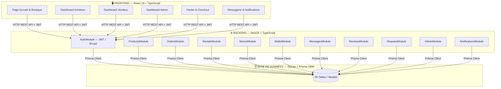

---

## 👥 2. Les 3 Rôles Utilisateurs

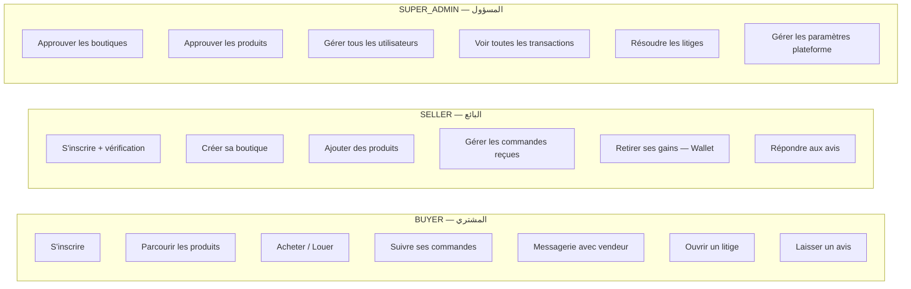

---

## 📐 3. Diagrammes de Classes — Par Module

### 🔵 Module 1 — Utilisateurs & Authentification

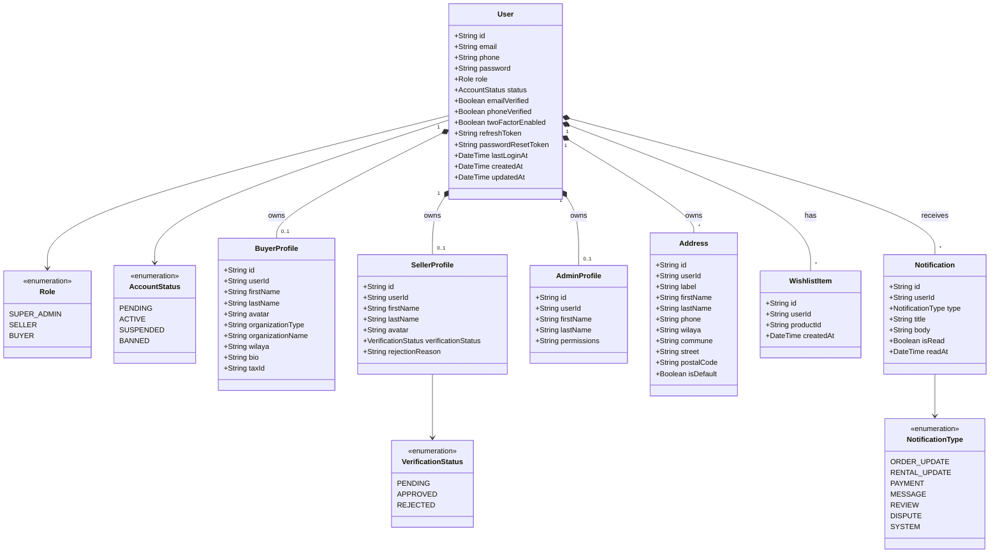

---

### 🟡 Module 2 — Boutiques & Catalogue Produits

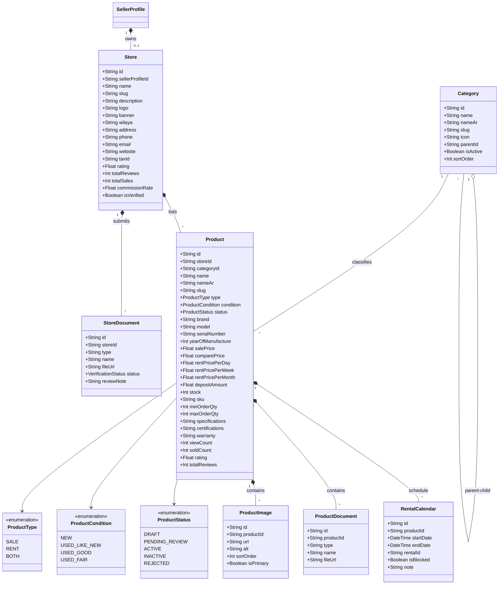

---

### 🟠 Module 3 — Commandes & Panier

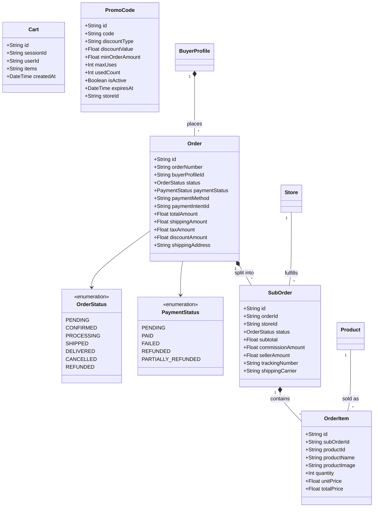

---

### 🟢 Module 4 — Locations (Rentals)

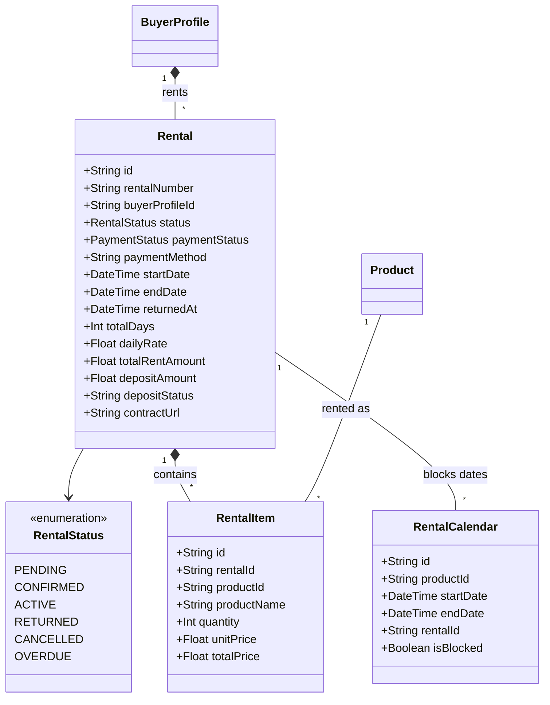

---

### 🔴 Module 5 — Finance & Portefeuille

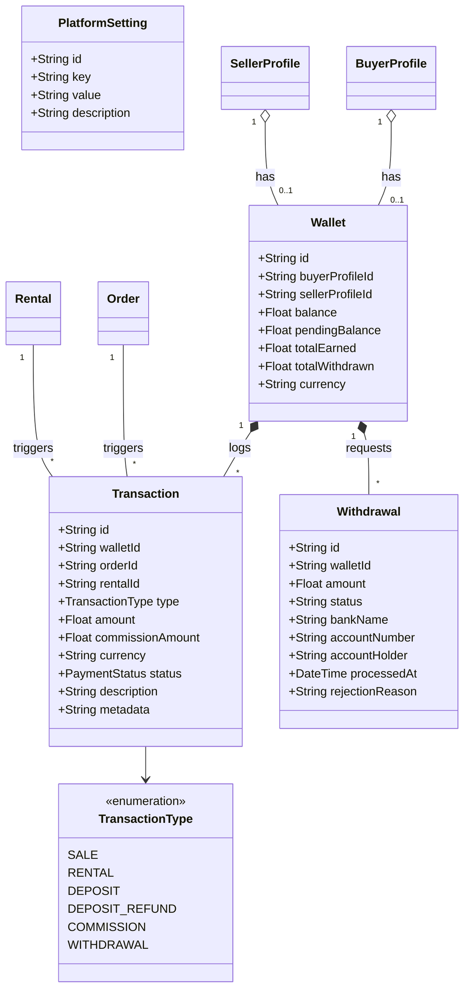

---

### 🟣 Module 6 — Support, Avis & Messagerie

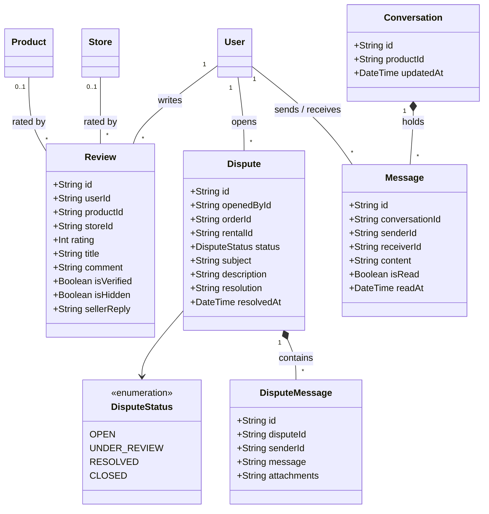

---

## 🔄 4. Flux Métier Principaux (Workflows)

### Flux 1 — Inscription & Activation d'un Vendeur

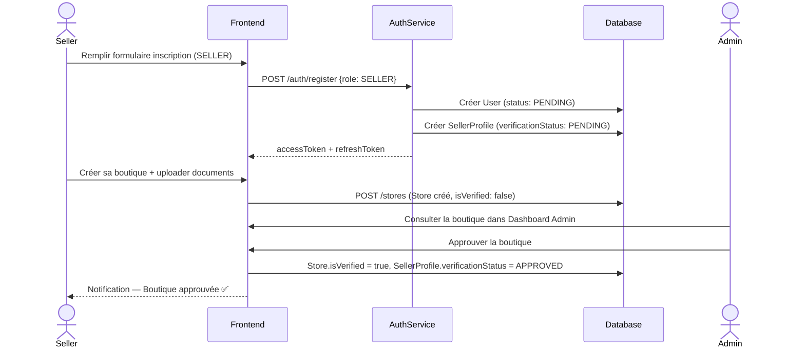

---

### Flux 2 — Achat d'un Produit (Multi-Vendeur)

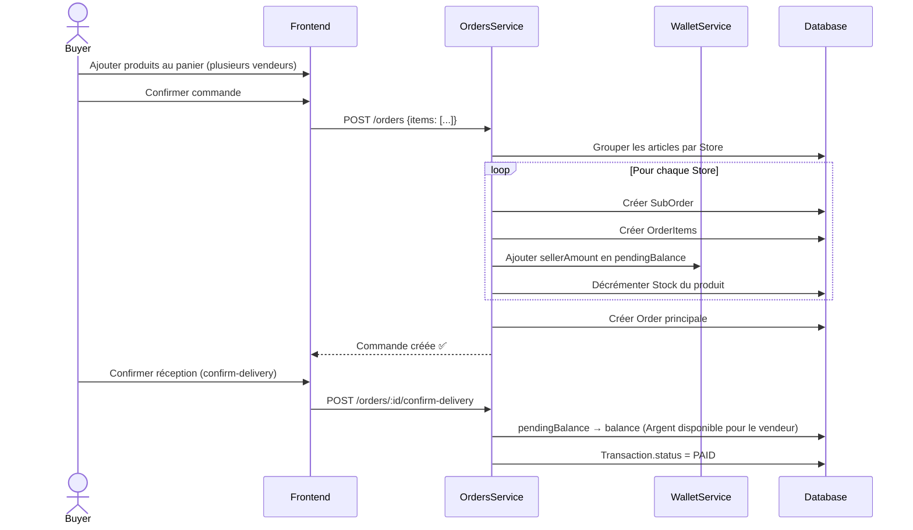

---

### Flux 3 — Location d'un Équipement

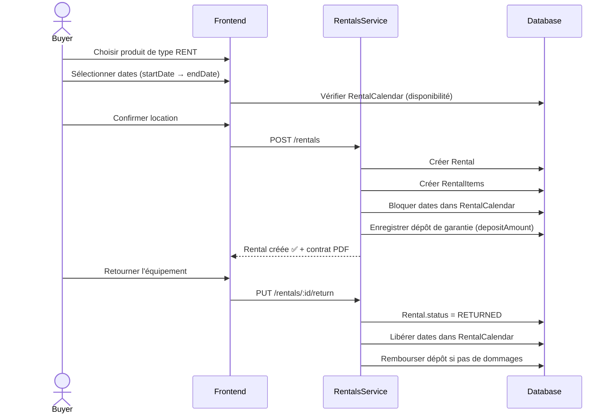

---

### Flux 4 — Retrait des Gains (Vendeur)

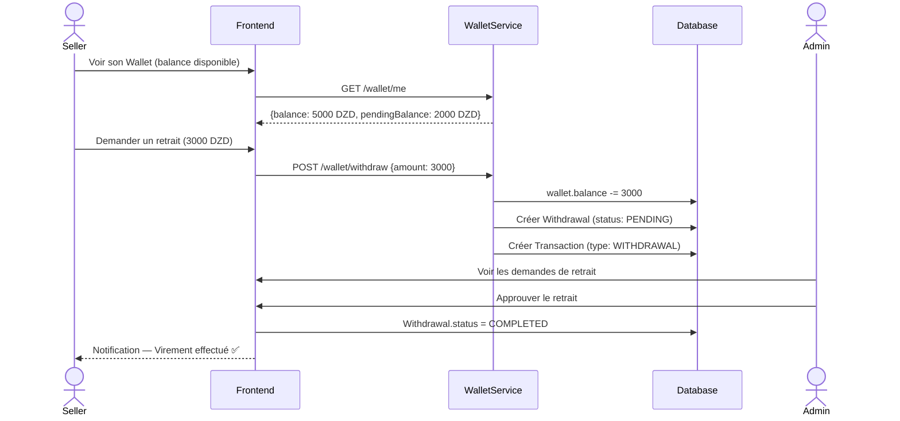

---

## 🌐 5. API REST — Points d'Accès Principaux

| Module | Méthode | Endpoint | Rôle requis |
|--------|---------|----------|-------------|
| **Auth** | POST | `/auth/register` | Public |
| | POST | `/auth/login` | Public |
| | GET | `/auth/me` | Connecté |
| | POST | `/auth/logout` | Connecté |
| **Produits** | GET | `/products` | Public |
| | GET | `/products/:id` | Public |
| | POST | `/products` | SELLER |
| | PATCH | `/products/:id` | SELLER |
| | DELETE | `/products/:id` | SELLER |
| **Commandes** | POST | `/orders` | BUYER |
| | GET | `/orders/my-orders` | BUYER |
| | GET | `/orders/store/:id` | SELLER |
| | POST | `/orders/:id/confirm-delivery` | BUYER |
| **Locations** | POST | `/rentals` | BUYER |
| | GET | `/rentals/my-rentals` | BUYER |
| | PUT | `/rentals/:id/return` | BUYER |
| **Boutiques** | POST | `/stores` | SELLER |
| | GET | `/stores/my-store` | SELLER |
| | GET | `/stores/:slug` | Public |
| **Wallet** | GET | `/wallet/me` | Connecté |
| | POST | `/wallet/withdraw` | SELLER |
| **Admin** | GET | `/admin/stats` | SUPER_ADMIN |
| | POST | `/admin/stores/:id/verify` | SUPER_ADMIN |
| | POST | `/admin/users/:id/suspend` | SUPER_ADMIN |
| **Messages** | GET | `/messages/conversations` | Connecté |
| | POST | `/messages/send` | Connecté |
| **Avis** | POST | `/reviews` | BUYER |
| | GET | `/reviews/product/:id` | Public |
| **Litiges** | POST | `/disputes` | BUYER |
| | GET | `/disputes` | Connecté |

---

## 🛠️ 6. Stack Technologique

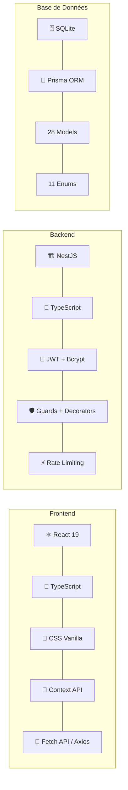

---

## 📊 7. Résumé Statistique du Projet

| Catégorie | Détail | Nombre |
|---|---|---|
| **Modèles BDD** | Users, Products, Orders, Rentals, Wallet... | **28** |
| **Enums** | Role, OrderStatus, ProductType... | **11** |
| **Modules NestJS** | Auth, Products, Orders, Wallet... | **13** |
| **Endpoints API** | GET, POST, PATCH, DELETE | **40+** |
| **Rôles** | BUYER, SELLER, SUPER_ADMIN | **3** |
| **Pages Frontend** | Home, Shop, Auth, Dashboards... | **6+** |
| **Flux Métier** | Inscription, Achat, Location, Retrait | **4** |
